____

__本 科 生 毕 业 论 文（设计）__

文献综述和开题报告

__题目__

对中算法研究与仿真系统开发

__姓名与学号__

    张茜  3220100602       

__指导教师__

    张志新                   

__年级与专业__

　　2022级过程装备与控制工程                                            

__所在学院（系）__

　　能源工程学院           

一、题目

对中算法研究与仿真系统开发

二、指导教师对文献综述和开题报告的具体内容要求：

文献综述：

1. 查阅国内外有关对中技术的相关文献，其中外文5篇以上，并选其中1篇翻译。

2. 通过查阅相关文献，了解国内外有关对中技术的现状，并进行正确的评述。
3. 明确课题背景，撰写文献综述。

开题报告：

1. 深入阐述本课题的背景与意义。
2. 提出对中算法研究与仿真系统的总体设计方案，主要包含以下内容： a \)常见对中场景及对中机理及算法研究路径；b）对中模拟及算法仿真系统开发方案； 

3. 对提出的方案进行可行性分析
4. 提出方案实施计划及时间进度表。
5. 撰写课题报告  

指导老师（签名）：             

年　　月　　日

目　录

[一、文献综述	1](#_Toc28176)

[1  背景介绍	1](#_Toc28750)

[1\.1  轴不对中类型	1](#_Toc7042)

[1\.2  轴对中方法概述	2](#_Toc31436)

[2  国内外研究现状	3](#_Toc29572)

[2\.1  国外研究现状	3](#_Toc17947)

[2\.2  国内研究现状	4](#_Toc18044)

[3  研究展望	5](#_Toc22555)

[4  参考文献	6](#_Toc14699)

[二、开题报告	8](#_Toc10145)

[1  问题提出的背景	8](#_Toc26744)

[1\.1  背景介绍	8](#_Toc32186)

[1\.2  轴对中方法概述	9](#_Toc2068)

[1\.3  本研究的意义和目的	10](#_Toc27723)

[2  论文的主要内容和技术路线	11](#_Toc11917)

[2\.1  主要研究内容	11](#_Toc18849)

[2\.2  技术路线	12](#_Toc3381)

[2\.3  可行性分析	13](#_Toc16239)

[3  研究计划进度安排与预期目标	14](#_Toc6014)

[3\.1  进度安排	14](#_Toc15756)

[3\.2  预期目标	14](#_Toc4446)

[4  参考文献	14](#_Toc4583)

[三、外文翻译	15](#_Toc29311)

[四、外文原文	23](#_Toc7509)

一、文献综述

1.  背景介绍

旋转机械是机械设备中的一个重要大类，同时也是现代工业生产中必不可少的重要组成部分，他们在电力、冶金、采矿、运载工具等国家支柱行业和关系到国家安危的军工行业都有着广泛的应用，并且是这些行业内的关键性、决定性设备\[1\]。随着“中国制造2025”和“工业4\.0”战略的深入推进，现代工业逐步向大型化、高速化、精密化、智能化方向发展，这对机械安装精度提出了更高要求。

旋转机械的核心部件——转子系统的运行稳定性直接决定了整个工艺流程的安全系数与生产效率。旋转机械由工作机提供动力来源，由联轴器把主、从动轴联接在一起。在理想状态下，主、从动轴轴心线为一条直线，即两半联轴器轴线处于平行且同心的正确位置\[2\]。然而，在实际工程应用中，由于联轴器安装不精确、热膨胀不均匀、基础或底座不稳定、地基沉降或外部冲击\[3\]等复杂因素，使得不对中状态普遍存在。一家旋转设备服务组织所开展的调查结果显示，在被调查的160台机器中，仅有不到10%的设备处于可接受的同轴度误差限制范围内\[4\]，且工业中30%的机器停机是由于机器未对中造成的\[5\]。

当轴系存在平行不对中或角度不对中时，会对设备造成一定的影响。不对中故障会导致轴承和联轴器的非正常损坏，增加转子的附加载荷，改变临界转速，严重时可能引起摩擦、油膜失稳等严重后果\[6\]；增大能量损失，设备效率大大降低，设备运行精度降低\[7\]。

由此可见，轴对中不仅严重制约了旋转机械的运转效率与使用寿命，更对企业的安全生产构成了不可忽视的潜在威胁。因此，高效、精准的轴对中检测与校正技术对于降低设备故障率、保障生产线平稳运行具有重大的工程意义。

- 
	1.  轴不对中类型

轴不对中是指联轴器连接起来的两根轴的轴心线与两端的轴承中线不在同一直线上。轴不对中一般分为以下三种情况\[8\]：1\.平行不对中，两连接轴的轴线平行位置发生偏移，如图1\.1a所示；2\.角度不对中，两连接轴的轴线交叉成一角度，如图1\.1b所示；3\.综合不对中，两连接轴的轴线既存在平行位置的偏移又有轴线角度的交叉，如图1\.1c所示。在实际工业生产中，轴不对中情况一般都是综合不对中。

a）平行不对中              b\)角度不对中            c）综合不对中

图1\.1 轴不对中类型

- 
	1.  轴对中方法概述
		1.  传统机械对中方法

早期的对中工作主要依赖直尺塞尺法完成，是将直尺或刀口尺靠在一侧联轴器的外圆，用塞尺测量另一侧联轴器外圆上下左右的间隙，计算轴线偏差；再用千分尺测量得到上下左右的端面距离，得到张口偏差\[9\]，如图1\.2所示。该方法操作简便，但分辨率低，且受人为手感影响大，仅适用于低速、低精度的机械。

图1\.2 塞尺法示意图

随着对精度要求的提高，百分表法成为工业界设备对中的常用方法。将测量工装固定在设备固定端联轴器上，在调整端的联轴器上，用百分表测量两片联轴器端面间的轴向和径向间隙偏差\[10\]，示意图如图1\.3所示。尽管百分表法的测量精度较传统塞尺法得到提高，但仍然存在不可忽视的缺陷。1\.该方法属于接触式测量，根据百分表测头在光滑轴面形成的轨迹来确定回转轴心位置\[11\]，进而得到不对中量，所以当被测物体的表面存在缺陷或不是圆柱体时，这种方法就不适用；2\.百分表法需要根据不同的传动系统定制支架，支架的安装质量对测量精度影响较大\[12\]；3\.操作繁琐，需要多名技术人员协同配合安装；4\.技术人员还需要通过百分表示数现场计算得到调整量，工作效率低5\.当使用百分表法进行长跨距测量时，支撑架结构的刚性以及固定架上外伸支撑架的形变都会严重影响测量精度\[13\]。

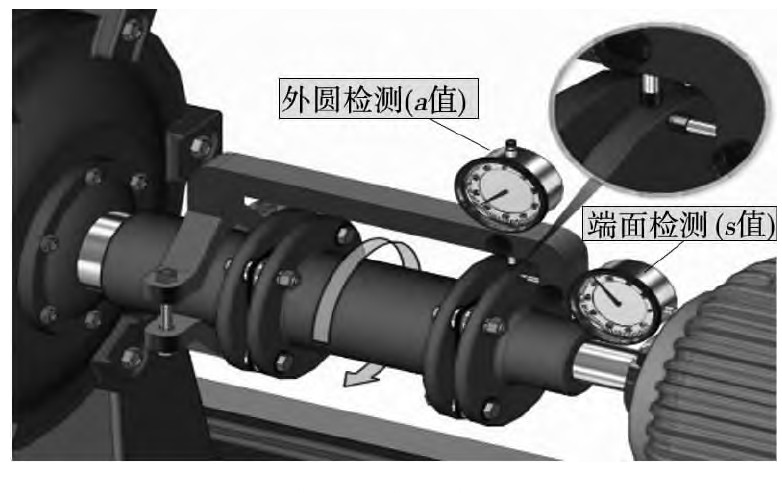

图1\.3 百分表法示意图

- 
	- 
		1.  激光对中法

激光对中仪是利用激光感应技术实现两个旋转设备中心相对位置测量的仪器。通常情况下，测量系统由安装在主、从动轴上的激光发射单元和接收单元组成，在旋转过程中，发射出的激光投射至对面的光敏探测器表面，利用轴系不对中导致的光斑位置周期性的变化得到轴系偏差，并计算出地脚螺栓所需的垂直和水平调整量。

激光对中仪相较传统对中方法具有以下优势：1\.测量精度高，测量速度快；2\.适用于多种尺寸的轴对中，适用范围广3\.调整方案可在屏幕上实时显示，人机交互体验好，对操作人员技术要求不高。激光对中仪已逐渐成为高精度轴对中测量的首选工具\[14\]。

1.  国内外研究现状
	1.  国外研究现状

国外在激光对中技术领域起步比较早，德国的普卢福公司发明制造了世界上第一台激光对中仪\[15\]。自从有了激光对中仪，操作人员在对轴系进行对中时更方便、更精准，解决了传统测量方法的不足之处。目前，激光对中技术在国外发展非常成熟，已经形成了一个比较完整的体系。目前世界上比较常见的激光对中仪品牌有Acoem激光对中仪、SKF激光对中仪、Easy\-laser激光对中仪、FixturLaserShaft激光对中仪等。除此之外还有许多品牌，大多来自德国或者瑞典，这些公司的产品已经过多年的市场经验和技术积累，其制造出的产品已经相当成熟，其测量精度通常可以达到1μm，能够满足石油化工、电力、船舶制造等对精度要求极高的工业领域的需求\[16\]。

在激光对中系统中，PSD主要用于接收激光光斑，并通过光电流输出精确反馈光斑的二维或一维坐标。早期研究主要集中在提高PSD的线性度、降低环境噪声以及优化光斑质心解算算法等方面\[17\]。研究人员对PSD在不同入射角和非均匀光照下的误差模型进行了深入分析，并通过引入复杂的补偿算法，如多项式拟合或神经网络校正，将测量精度提升至亚微米级别\[18\]。针对轴对中这一特定的高精度应用场景，国外的研究进一步深化了基于PSD的数学模型。瑞典的Fixturlaser和德国的Pruftechnik等公司作为该领域商业化的领导者，他们的产品多采用双PSD模型，以实现对耦合误差的实时修正和高精度的位姿测量\[19\]。国际市场如此成熟的产品化还得益于对核心器件的高效集成和先进算法的封装，通过使用高稳定性的单模激光二极管（LD）和温度补偿电路，确保了系统在不同环境温度下的稳定输出\[20\]。

- 
	1.  国内研究现状

国内的激光对中技术研究起步较晚。早期受限于国外技术垄断与进口设备的高昂成本，国内工业主要依赖精度较低的传统百分表法。为打破对国外设备的依赖并实现仪器国产化，国内学者积极投身相关研究，在测量机理建模和系统结构设计上进行了大量的探索。

首先，在基础的单LD\-PSD模型研究方面，重点在于解决反射式结构的数学解算问题。周彩霞\[21\]针对单LD\-PSD激光对中系统，建立了用于轴系对中测量的数学模型。通过几何分析推导激光束在PSD上的椭圆轨迹，依据四顶点坐标解算角度与平行偏差，并给出地脚调节公式。闫天彦\[22\]研究了半导体激光器与位置敏感探测器特性，建立了单LD\-PSD与双LD\-PSD两种激光对中数学模型，推导了测量算法与调整方案，并通过实验验证了模型可行性，为激光对中仪的国产化提供了理论基础。

其次，为了克服单光束结构的局限性，部分学者探索了单LD\-双PSD模型，即通过分光或多传感器布局来提升信息获取量。李忠科、张晓娟\[23\]提出了三种激光对中仪结构方案，分别是LD\-PSD\-棱镜、LD\-双PSD\-反射镜、双LD\-PSD，其中重点推导了后两种数学模型，得到了在任意两个转角位置测量即可消除安装误差、获取两轴平行与角度偏差的解析式，并通过计算机仿真验证了模型的正确性。

然而，随着对精度要求越来越高，并为了适应复杂的工业现场工况，目前国内研究的主流向双LD\-PSD模型转移。该结构利用两套独立的激光发射与接收单元对向测量，在几何原理上具有更高精度。刘广军\[24\]研制了基于虚拟仪器的双LD\-PSD激光对中系统，建立了相应数学模型，设计了包括PSD信号处理、A/D转换等硬件电路，提出了PSD非线性误差的双边线性插值补偿算法，并开发了上下位机软件，实现了轴系偏差的高精度测量与实时显示。马喜来、康戈文\[25\]设计了一种双LD\-PSD结构的对中仪，提出了四点法、两点法及任意多点法三种测量原理，以适配不同工况。并采用高精度PSD进行光斑坐标采集，结合倾角传感器实现角度测量，并通过计算机直接计算对中偏差与调整量，提升了测量灵活性与效率。梁平等人\[26\]分析了激光对中仪的测量原理与数学模型，推导了平行不对中和角度不对中的量化公式，并通过实验验证了算法的准确性。文章进一步提出了针对位移传感器、倾角仪及整机的系统校准方法，为激光对中仪的性能评估提供了依据。学者孙政铖\[27\]深入探究了双LD\-双PSD模型的空间几何关系，通过联立PSD平面方程与激光方向向量，推导出了激光光斑在探测器表面的运动轨迹参数方程；在测量算法上，提出了一种对称采样轴心拟合算法，即利用有限的光斑坐标及角度信息，求解参数方程中的轴心偏移量，从而精确计算不对中分量。

综上所述，国内在激光对中技术的硬件架构与数学模型研究上已日趋成熟。但在算法的低成本验证手段方面仍有待补充，现有研究多依赖实物实验，缺乏纯软件验证环境。因此，基于MATLAB开发一套针对性的双LD\-PSD对中算法仿真系统，对于直观展示对中机理、验证算法的正确性具有重要的工程应用价值，也能为后续的实物仪器开发提供前期的理论参考。

1.  研究展望

尽管国内学术界在激光对中技术的理论研究方面已取得一定进展，但科研成果向产业化转型落地的情况依然不容乐观，成熟的国产化商用设备屈指可数。目前的对中市场呈现出显著的“两极分化”态势：少数大型企业为确保设备精度，不得不承担高昂成本，依赖进口设备；而绝大多数中小型工厂出于缩减成本的考量，仍被迫沿用传统的塞尺法或百分表测量法。这种传统手段不仅操作繁琐、耗时费力，且难以消除人为读数误差，严重制约了生产效率的提升。

为了打破这一技术壁垒与价格垄断，实现高端对中仪器的国产化替代，必须首先攻克其核心算法问题，并寻找一种低成本的研发验证手段。因此，本研究结合工程实际，将研究重点聚焦于对中工艺的核心算法研究与仿真系统开发。旨在通过构建高精度的数学模型与可视化仿真平台，在无需昂贵实体设备的条件下，实现对核心对中算法的高效验证与参数优化。本研究建立的仿真模型与系统，可为相关算法的验证与优化提供一个低成本的工具，以辅助后续可能的硬件研发。

1.  参考文献
2. 韦佳鑫\. 滚动轴承振动信号分析与故障诊断方法研究\[D\]\. 中国矿业大学, 2018\.
3. 黄冬梅\. 联轴器对中的几种方法比较\[J\]\. 机电信息, 2017, \(30\): 67\-68\.
4. 许美叶\. 联轴器不对中约束下转子\-轴承系统的非线性动力学行为与振动特性研究\[D\]\. 天津理工大学, 2025\.
5. Giannone, J\. "Laser\-optical shaft alignment cuts energy costs\." *World Pumps* 1995 \(1995\):  22\-24\.
6. Shubhangi, Gurav, et al\. "Analysis of study of effect of misalignment on rotating shaft\."  *Int\. J\. Innov\. Res\. Sci\. Eng\. Technol\.\(IJIRSET\)\. e\-ISSN* \(2022\): 2319\-8753\.
7. 李胜利, 屈运动\. 空分装置压缩机振动故障分析与处理\[J\]\. 设备管理与维修, 2025, \(16\): 69\-72\.
8. Vietsch, Jan Willem Karel\. "Method of assessing shaft alignment based on energy efficiency\." U\.S\. Patent No\. 9, 261, 424\. 16 Feb\. 2016\.
9. R\.B\. McMillan, Rotating Machinery: Practical Solutions to Unbalance and Misalignment, The Fairmont Press, Inc\., 2004\.
10. 黄滔, 马若晨, 王政凯, 等\. 数字化测量技术在旋转机械联轴器找中中的应用\[J\]\. 现代制造技术与装备, 2025, 61\(03\): 93\-95\.
11. 夏瓦祥\. 激光对中仪在联轴器对中调整中的应用\[J\]\. 设备管理与维修, 2022, \(05\): 110\-112\.
12. 齐凯, 李泷杲, 黄翔, 等\. 基于机器视觉的直升机传动系统回转轴线标定方法\[J\]\. 航空制造技术, 2024, 67\(22\): 110\-117\.
13. 齐凯\. 基于视觉测量的直升机传动系统对中技术研究\[D\]\. 南京航空航天大学, 2023\.
14. 成海青\. 表架挠度对找正结果的影响及其校正方法\[J\]\. 风机技术, 1996, \(03\): 38\-42\.
15. 于洋\. 基于透镜阵列的轴对中检测技术研究\[D\]\. 长春理工大学, 2021\.
16. Lucovsky G\. Photoeffects in nonuniformly irradiated p\-n junctions\[J\]\. J Appl Phys, 1990, 3l\(6\): 1088\-1095．
17. EasyLaser\. D\-series Shaft Alignment System Manual \[M\]\. Easy\-Laser AB, 2024\.
18. Zhang Z X, Wang J\. Research on the High\-Precision Compensation Method of PSD Based on Polynomial Fitting \[J\]\. Sensors and Transducers, 2019, 23 \(4\): 203\-207\.
19. Bharat K, Gupta M, Jain P\. Compensation of Position Sensitive Detector Non\-linearity using Artificial Neural Network \[C\]\. International Conference on Information Systems and Computer Networks \(ISCON\)\. IEEE, 2013: 407\-411\.
20. Wang Z G, Li B, Chen B\. The development of dual\-PSD laser alignment system for long\-span shafting \[J\]\. Measurement, 2021, 185: 110052\.
21. Wei H Z, Zhang Y J, et al\. Testing and Modeling of Shaft Vibrations Due to Misalignment \[J\]\. MDPI Journal of Marine Science and Engineering, 2024, 12 \(12\): 22\.
22. 周彩霞\. 单激光束对中仪测量系统数学模型的建构\[J\]\. 自动化与仪器仪表, 2017, \(09\): 22\-23\+27\.
23. 闫天彦\. 激光对中数学模型研究\[D\]\. 昆明理工大学, 2012\.
24. 李忠科, 张晓娟\. 激光对中仪数学模型与计算机仿真研究\[J\]\. 应用激光, 2006, \(03\): 191\-194\+208\.
25. 刘广军\. 基于虚拟仪器的激光对中仪的设计与研制\[D\]\. 沈阳理工大学, 2012\.
26. 马喜来, 康戈文\. 一种基于PSD的具有多测量方法的双光束激光对中仪的研制\[J\]\. 计量与测试技术, 2004, \(11\): 10\-12\.
27. 梁平, 张勇, 黄耀坤\. 激光对中仪测量算法和校准\[J\]\. 工具技术, 2020, 54\(10\): 99\-103\.
28. 孙政铖\. 基于轴心拟合求解的不对中算法研究与对中仪开发\[D\]\. 浙江大学, 2025\.

二、开题报告

1.  问题提出的背景
	1.  背景介绍

旋转机械作为现代工业生产中的核心动力设备，广泛应用于电力、冶金、采矿、交通运输等国民经济支柱行业。转子系统是旋转机械的核心组成部分，其运行稳定性直接影响整个工艺流程的安全与效率。在机械传动中，工作机通过联轴器将主动轴与从动轴连接以传递扭矩。在理想的状态下，主、从动轴的旋转中心线应重合为一条直线，即两半联轴器轴线处于平行且同心的正确位置\[1\]。然而，在实际工程应用中，受限于联轴器安装误差、设备运行时的热膨胀不均匀、基础底座刚性不足、地基沉降以及外部载荷冲击\[2\]等因素的综合影响，轴系不对中情况在工业现场普遍存在。一家旋转设备服务组织所开展的调查结果显示，在被调查的160台机器中，仅有不到10%的设备处于可接受的同轴度误差限制范围内\[3\]，并且另一项调查也发现工业中30%的机器停机是由于机器未对中造成的\[4\]。当轴系存在不对中情况时，会产生周期性的交变载荷，对设备性能造成显著负面影响。从动力学角度出发，不对中会导致轴承和联轴器承受额外的附加载荷，加速设备零部件的疲劳损坏，改变临界转速特性，严重时可能会造成动静摩擦以及油膜失衡\[5\]等故障；从能效角度出发，不对中会增加系统运行阻力，导致能量传输时损失增大，显著降低设备的运行效率与工作精度\[6\]。综上所述，轴对中不仅严重制约了旋转机械的运转效率与使用寿命，更对企业的安全生产构成了不可忽视的潜在威胁。因此，高效、精准的轴对中检测与校正技术对于降低设备故障率、保障生产线平稳运行具有重大的工程意义。

轴不对中是指联轴器连接起来的两根轴的轴心线与两端的轴承中线不在同一直线上。轴不对中一般分为以下三种情况\[7\]：1\.平行不对中，两连接轴的轴线平行位置发生偏移，如图1\.1a所示；2\.角度不对中，两连接轴的轴线交叉成一角度，如图1\.1b所示；3\.综合不对中，两连接轴的轴线既存在平行位置的偏移又有轴线角度的交叉，如图1\.1c所示。在实际工业生产中，轴不对中情况一般都是综合不对中。

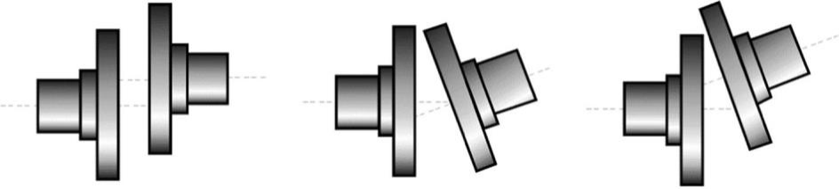

a）平行不对中              b\)角度不对中             c）综合不对中

图1\.1 轴不对中类型

- 
	1.  轴对中方法概述
		1.  传统机械对中方法

早期的对中工作主要依赖直尺塞尺法完成，是将直尺或刀口尺靠在一侧联轴器的外圆，用塞尺测量另一侧联轴器外圆上下左右的间隙，计算轴线偏差；再用千分尺测量得到上下左右的端面距离，得到张口偏差\[8\]，如图1\.2所示。该方法操作简便，但分辨率低，且受人为手感影响大，仅适用于低速、低精度的机械。

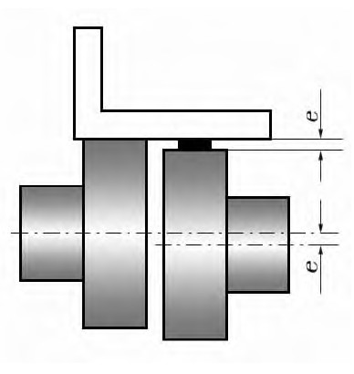

图1\.2 塞尺法示意图

随着对精度要求的提高，百分表法成为工业界设备对中的常用方法。将测量工装固定在设备固定端联轴器上，在调整端的联轴器上，用百分表测量两片联轴器端面间的轴向和径向间隙偏差\[9\]，示意图如图1\.3所示。尽管百分表法的测量精度较传统塞尺法得到提高，但仍然存在不可忽视的缺陷。1\.该方法属于接触式测量，根据百分表测头在光滑轴面形成的轨迹来确定回转轴心位置\[10\]，进而得到不对中量，所以当被测物体的表面存在缺陷或不是圆柱体时，这种方法就不适用。并且百分表法需要根据不同的传动系统定制支架，支架的安装质量对测量精度影响较大\[11\]；且操作繁琐，需要多名技术人员协同配合安装；技术人员还需要通过百分表示数现场计算得到调整量，工作效率低。当使用百分表法进行长跨距测量时，支撑架结构的刚性以及固定架上外伸支撑架的形变都会严重影响测量精度\[12\]。

图1\.3 百分表法示意图

- 
	- 
		1.  激光对中法

激光对中仪是利用激光感应技术实现两个旋转设备中心相对位置测量的仪器。通常情况下，测量系统由安装在主、从动轴上的激光发射单元和接收单元组成，在旋转过程中，发射出的激光投射至对面的光敏探测器表面，利用轴系不对中导致的光斑位置周期性的变化得到轴系偏差，并计算出地脚螺栓所需的垂直和水平调整量。

激光对中仪相较传统对中方法具有以下优势：1\.测量精度高，测量速度快；2\.适用于多种尺寸的轴对中，适用范围广3\.调整方案可在屏幕上实时显示，人机交互体验好，对操作人员技术要求不高。激光对中仪已逐渐成为高精度轴对中测量的首选工具\[13\]。

- 
	1.  本研究的意义和目的

尽管国内学术界在激光对中技术的理论研究方面已取得一定进展，但科研成果向产业化转型落地的情况依然不容乐观，成熟的国产化商用设备屈指可数。目前少数大型企业为确保设备精度，不得不承担高昂成本，依赖进口设备；而绝大多数中小型工厂出于缩减成本的考量，仍被迫沿用传统的塞尺法或百分表测量法。这种传统手段不仅操作繁琐、耗时费力，且难以消除人为读数误差，严重制约了生产效率的提升。

为了打破这一技术壁垒与价格垄断，实现高端对中仪器的国产化替代，需要首先攻克其核心算法问题，并寻找一种低成本的研发验证手段。因此，本研究结合工程实际，将研究重点聚焦于对中的核心算法研究与仿真系统开发。旨在通过构建高精度的数学模型与可视化仿真平台，在无需昂贵实体设备的条件下，实现对对中算法的高效验证与参数优化。本研究建立的仿真模型与系统，可为相关算法的验证与优化提供一个低成本的工具，以辅助后续可能的硬件研发。

1.  论文的主要内容和技术路线
	1.  主要研究内容
		1.  理论建模与算法研究

本研究的理论核心在建立适用于双LD\-双PSD的高精度解算模型。双LD\-双PSD模型是由两个激光发射器（LD）和两个位置敏感探测器（PSD）组成，结构如图2\.1所示，两个被测轴上安装的对中设备各含一个LD和一个PSD，两个激光发射器发出的激光束分别照射到对面的PSD上。首先，基于空间解析几何理论，建立双LD\-双PSD测量结构的空间几何模型，并推导在平行不对中、角度不对中及综合不对中工况下，两束激光在各自探测器平面的运动轨迹方程。在此基础上，重点研究轴系旋转过程中光斑坐标与轴心位置的对应关系。通过分析PSD传感器采集到的多组光斑坐标数据，利用数值拟合算法消除测量误差，从而准确计算出轴系的平行不对中量以及角度不对中量。结合设备的地脚跨距等几何结构参数，推导出地脚或轴承座所需的垫片厚度和水平/垂直方向调整量，为后续的仿真系统提供精确的底层算法支撑。

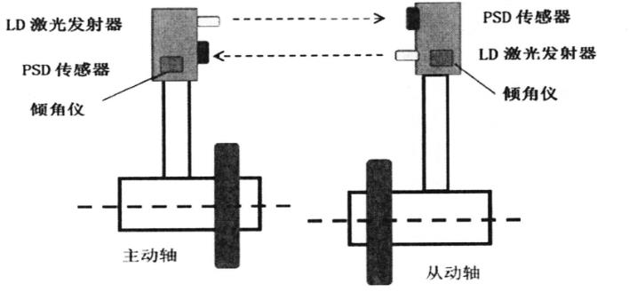

图2\.1 双LD\-双PSD对中模型

- 
	- 
		1.  交互式仿真系统开发

为了构建高效的算法验证环境并实现对中过程的可视化监测，研究将基于MATLAB搭建一套交互式数字化仿真平台，构建包含设备参数配置、激光发射、PSD响应、不对中量设定及三维实时渲染的虚拟仿真环境，以模拟不同程度的平行和角度不对中工况。研究的重点在于实现数值计算与几何图形的动态关联，当用户在界面中输入虚拟的调整量时，系统自动调用后台算法重新计算轴系位置，并刷新绘图窗口，动态演示轴系从不对中逐步趋向对中的调整过程，实现数值与图像的同步联动。

- 
	- 
		1.  仿真系统可靠性验证

为了全面评估所开发仿真系统的有效性与可靠性，后续将开展验证工作。首先，进行核心算法的精度校验与对比验证。构建包含多组不同程度平行与角度不对中参数的测试数据，将仿真解算出的不对中量与理论值进行比对，验证算法的精度；此外还将引入Easy\-laser激光对中仪作为参考标准，通过在仿真系统中输入和实物仪器完全一样的机器尺寸和工况参数，看两者的计算结果是否一致。其次，开展系统在非理想条件下的鲁棒性测试。考虑到操作现场的机器震动干扰，需要在理想的仿真数据中人为加入一些随机噪声来模拟真实的信号抖动，确保在数据有波动时，系统依然能算出轴心的位置，且误差不会很大。

- 
	1.  技术路线

根据上文对研究内容的分析，本研究的技术路线如图2\.2所示。

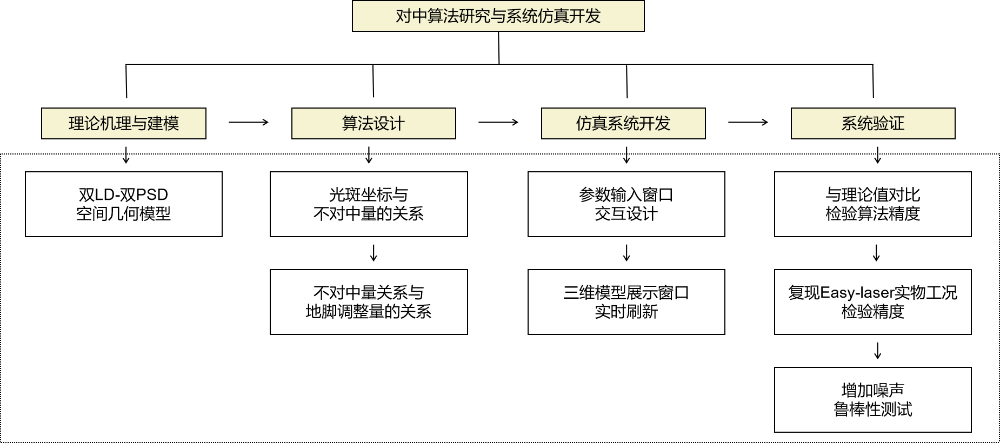

图2\.2 技术路线图

首先，开展理论机理研究，构建双LD\-双PSD空间几何模型，确立测量系统的数学基础；在此基础上进行核心算法设计，推导“光斑坐标—不对中量—地脚调整量”的解算逻辑，建立精确的数学映射关系。随后，进入仿真系统开发阶段，设计参数输入交互窗口，并实现三维模型实时刷新技术，实现数值计算与动态展示的同步联动。最后，实施多维度的仿真系统验证，通过与理论值对比、复现Easy\-Laser激光对中仪实物工况以及叠加噪声的鲁棒性测试，全面检验系统的计算精度与抗干扰能力，确保仿真系统的可靠性与工程实用性。

- 
	1.  可行性分析

轴系对中的本质是空间刚体运动学问题，基于解析几何与矩阵变换的理论基础已十分成熟。双LD\-PSD测量原理清晰，相关的几何推导公式在国内外文献中有充分的依据，为数学模型的构建提供了理论保障。

MATLAB具备强大的矩阵运算能力与丰富的数据可视化工具箱，适合进行算法验证与工程仿真系统的开发。为仿真系统的开发提供了技术支持。

本研究主要采用仿真形式，无需额外购置昂贵的激光对中仪实物或大型机械台架，研发成本低。通过仿真替代实物实验，不受场地与时间限制，具有灵活性与可操作性。

1.  研究计划进度安排与预期目标
	1.  进度安排

表3\.1 进度安排

时间

内容

2025年11月

为开展毕业设计做准备工作，例如学习选题相关领域

2025年12月

阅读文献，完成文献综述、开题报告和外文翻译

2026年1月

完成对中算法的理论推导与模型构建

2026年3月

搭建仿真系统界面，设计参数输入和三维模型展示窗口

2026年4月

进行精度校验与鲁棒性评估

2026年5月

撰写毕业论文，准备毕业答辩

- 
	1.  预期目标

1\.完成对中算法的推导，并完成对中仿真系统的开发

2\.对最终产品进行精度测试和鲁棒性评估

1.  参考文献
2. 黄冬梅\. 联轴器对中的几种方法比较\[J\]\. 机电信息, 2017, \(30\): 67\-68\.
3. 许美叶\. 联轴器不对中约束下转子\-轴承系统的非线性动力学行为与振动特性研究\[D\]\. 天津理工大学, 2025\.
4. Giannone, J\. "Laser\-optical shaft alignment cuts energy costs\." *World Pumps* 1995 \(1995\): 22\-24\.
5. Shubhangi, Gurav, et al\. "Analysis of study of effect of misalignment on rotating shaft\." *Int\. J\. Innov\. Res\. Sci\. Eng\. Technol\.\(IJIRSET\)\. e\-ISSN* \(2022\): 2319\-8753\.
6. 李胜利, 屈运动\. 空分装置压缩机振动故障分析与处理\[J\]\. 设备管理与维修, 2025, \(16\): 69\-72\.
7. Vietsch, Jan Willem Karel\. "Method of assessing shaft alignment based on energy efficiency\." U\.S\. Patent No\. 9,261,424\. 16 Feb\. 2016\.
8. R\.B\. McMillan, Rotating Machinery: Practical Solutions to Unbalance and Misalignment, The Fairmont Press, Inc\., 2004\.
9. 黄滔, 马若晨, 王政凯, 等\. 数字化测量技术在旋转机械联轴器找中中的应用\[J\]\. 现代制造技术与装备, 2025, 61\(03\): 93\-95\.
10. 夏瓦祥\. 激光对中仪在联轴器对中调整中的应用\[J\]\. 设备管理与维修, 2022, \(05\): 110\-112\.
11. 齐凯, 李泷杲, 黄翔, 等\. 基于机器视觉的直升机传动系统回转轴线标定方法\[J\]\. 航空制造技术, 2024, 67\(22\): 110\-117\.
12. 齐凯\. 基于视觉测量的直升机传动系统对中技术研究\[D\]\. 南京航空航天大学, 2023\.
13. 成海青\. 表架挠度对找正结果的影响及其校正方法\[J\]\. 风机技术, 1996, \(03\): 38\-42\.
14. 于洋\. 基于透镜阵列的轴对中检测技术研究\[D\]\. 长春理工大学, 2021\.

三、外文翻译

一个带有双PSD的激光轴校准系统

摘  要

轴对中是旋转机械安装和维护过程中的一项重要技术。为了改变传统的手动轴对中方式，使测量更加简便、精确，我们设计了一种采用双位置敏感探测器（Position Sensing Detector，PSD）的高精度激光对中系统。该系统由两个小型测量单元（激光发射器和检测器）以及一台装有测量软件的掌上电脑（Personal Digital Assistant，PDA）组成。与单PSD系统相比，采用双PSD的激光对中系统具有更高的测量精度，并已成功应用于实际轴对中的设计和实施。该系统的偏移测量范围为±4mm，分辨率为1\.5μm，精度优于2μm。

__关键词：__旋转机械；轴对中；激光对中；位置敏感探测器（PSD）；激光微位移测量

1.  引言

当两根轴的旋转中心线基本共线时，即可实现精确对中。若要确定两台机器之间所存在的错位程度，则需要对存在于它们之间的水平偏移量以及角度偏差量这两项参数进行查验。水平偏移量是指两条旋转中心线之间的距离，而角度偏差则是由两条中心线未对齐而产生的夹角、存在于这两条线之间的夹角。传统的精确轴对中方法是千分表对中法（Piotrowski,1995），其中最常用的两种方法是轮缘法和反向指示器法。

当采用传统的技术手段时，测量所得结果必须手动绘制成图表，并通过计算得出所需的修正值。而使用激光对中系统，所有这些步骤均可自动完成。机器进行移动过程中，实时的对中数值会即时显示。与以往需要采集16点轮缘和端面千分表读数的方法相比，激光对准系统可将每个联轴器的测量时间缩短50%（Perry,1998）。激光技术所带来的精度提升，也使得后续轴承对中所需的修正次数被最大限度地缩减。激光对准系统已被应用于越来越多需要高精度对准的轴系，例如转子系统（Brommundt和Krämer,2005）、振动分析（Lee,2004）、冷却塔风机（Luedeking,2003）、燃气轮机（Luedeking,2005）、连杆联轴器（Pan等,1998）、涡轮驱动给水泵（Parry,2001）等。

由我们所设计的单PSD激光对准系统此前已经被应用于实际地轴对中工作中（Jiao et al\., 2006）。本文所述地双PSD方法是在该单PSD激光对中系统的基础之上发展而来的，并通过对光路、电路和软件等方面进行了一定程度的改进，使得系统的测量精度得到提升。

1.  主要方法与技术
	1.  激光校准系统

激光对中技术所依据的测量原理，是建立在千分表对中法的基础之上的。千分表对中是一种精确的方法，前提是能够正确处理那些可能对读数产生不利影响的潜在问题（Studenberg, 2002；VibrAlign Inc\.,2002），包括：（1）指示杆挠度，（2）指示器自身的滞后效应，（3）分辨率低，（4）读数误差，（5）在机械连接中的作用，（6）指示杆接触的部件被激励器磁化，（7）轴的轴向间隙。

激光对中系统不使用带刻度盘的钢制测量杆，而是采用激光束。与钢制测量杆不同，激光束不存在下垂的缺点。此外，PSD提供高分辨率，并且PSD信号处理电路能够计算激光系统的读数，从而消除人为误差。所有这些因素共同造就了高精度。激光对中系统的示意图如图2\.1所示。

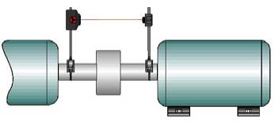

图2\.1 激光对中系统的示意图

- 
	1.  双PSD设计

在光学设计方面，与单PSD激光对准系统相比，双PSD激光对准系统在激光发射器和探测器之间增加了一个光学棱镜。如图2\.2所示，该45°棱镜将入射激光分成两束光，这两束光最终投射到PSD的感光表面。

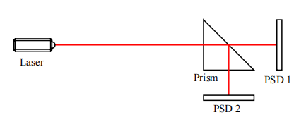

图2\.2 双PSD激光对中系统的结构

根据PSD的特性（Perry，2001），我们知道每个PSD上入射光斑的位置可以用以下公式描述：

其中，和分别是PSD在X方向和Y方向上的感光长度。此外，、、和分别表示入射光在PSD上产生的光电流信号。

在双PSD方法中，两个PSD上的光斑位置关于Y轴呈对映关系。因此，我们可以通过两个PSD的读数来计算光斑的最终位置。它们之间的关系为：

其中，PosX和PosY是光斑的最终位置值，\(PosX1,PosY1\)、\(PosX2,PosY2\)分别是光斑在PSD 1和PSD 2上的位置坐标。

通过这种方式，我们能够有效降低系统的测量误差，并且为后续将要描述的、在对中工作开始阶段对激光束进行校准时提供了一种可行的方法。

- 
	1.  PSD信号处理

位置敏感探测器（PSD）是一种光电器件，它将入射光斑转换为四个光电流，进而计算出连续的位置数据。大多数计算方法都基于模拟计算单元（Analog Computational Units，ACU）电路（Hamamatsu Photonics,2001；Jin和Li,1998）。通过这种方式，光斑位置数据被转换为电压信号，然后由模数转换器（Analog\-to\-Digital Converter，ADC）采集。然而，电路中诸如放大器或ACU等元件会给系统引入一些难以降低的额外噪声。

我们采用了一种通过单片微型计算机（Single Chip Micyoco，SCM）MSC1210来计算光斑位置的方法。MSC1210是一款混合信号器件，集成了高分辨率Δ\-Σ模数转换器（ADC）、8通道多路复用器和8位微控制器（Texas Instruments,2002）。因此，一个MSC1210即可完全处理两个PSD共计八个通道信号。信号处理电路只需要很少的元件，通过极大地降低电路噪声，提高了探测器单元的稳定性。

1.  系统设计

双PSD激光对中系统由两个小型测量单元（激光发射器和激光探测器）以及一台装有测量软件的PDA组成。图3\.1给出了该激光对准系统的示意图。

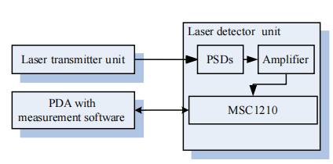

图3\.1 双PSD的激光校准系统

- 
	1.  激光发射单元

激光发射单元由二极管激光器和内置微米螺丝的机构组成，用于调节激光束的水平和垂直位置。根据所采用的PSD的响应光谱特性，其峰值敏感波长为960nm，但为了保证操作员在轴校准预对准时调整入射角时能够看到光束，因此选择了可见光波段的635nm二极管激光器。由于该PSD所具有的对光斑质心敏感的特性，激光波长或强度不会影响光斑位置的测量精度。

- 
	1.  激光探测单元

激光探测单元由PSD及其信号处理电路组成。在双PSD信号处理中，所采用的方法与单PSD信号处理类似（Luedeking,2005），即使用软件运算来计算激光光斑在PSD上的位置值，以替代通常涉及探测器和CPU之间众多元件（例如ACU、ADC等）的纯电路方法。这些元件会给系统带来一些难以降低的额外噪声。本研究选用单片机芯片MSC1210作为探测器的关键芯片。MSC1210包含一个24位分辨率的ADC，该ADC由一个输入多路复用器（Multiplexer，MUX）、一个可选缓冲器、一个可编程增益放大器（Programmable Gain Amplifier，PGA）和一个数字滤波器组成（Studenberg,2002）。其架构如图3\.2所示。

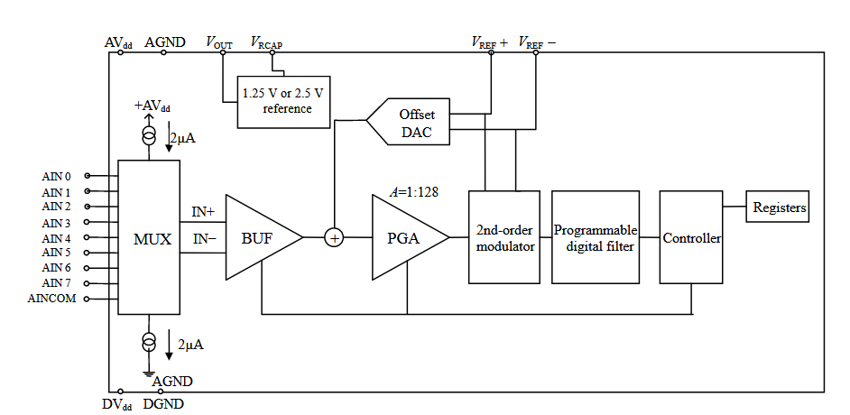

图3\.2 MSC1210的方框图

PSD传感器与CPU直接连接。后续测试证明，这种方法能够有效消除噪声，提高系统精度和稳定性。

PSD产生的光电流流经放大电路并被转换为电压信号。然后，MSC1210将这些电压信号转换为数字值，并通过RSC232将其传输到PDA。PDA上运行的软件在接收到数据后计算激光光斑的位置。

- 
	1.  PDA上的测量软件

在进行轴校准的过程中，激光发射器和探测器单元分别安装在固定端机器和可移动端机器上。启动测量软件后，程序可能会要求操作人员输入每一项必要的距离基准数据，操作人员必须测量并输入两个测量单元之间的距离，并将数据提供给软件。之后软件会进入等待激光探测器单元数据的状态中，整个测量过程会在显示屏上逐步进行。安装有测量单元的轴先被转到9点钟位置，然后是12点钟位置，最后是3点钟位置，之后，偏移量、角度偏差值和垫片调整值会清晰地显示在PDA屏幕上。水平和垂直方向的值都会实时显示，以便于机器的调整。

- 
	1.  预校准时的激光束校准

为了获得最佳的轴对准条件，需要检查投射到PSD表面的激光束入射角是否垂直。从图2\.2可以看出，只有当每个PSD上的激光光斑处于PSD中心时，才能认为激光垂直入射到探测器单元上。因此，在自校准软件中，我们定义了一个可接受的范围来调整激光发射器单元。

如图3\.3所示，如果光斑位置不在内圆（半径=25\.4μm）内，我们就调节激光发射器上的四维调整螺丝，直到光斑落入圆内。

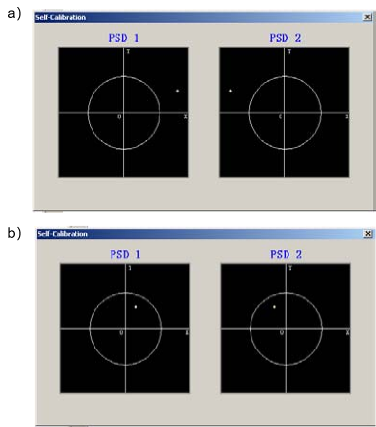

图3\.3 预校准时的激光束校准；a）调整前；b\)调整后

1.  系统测试

测试方式与之前的方法（Luedeking,2005）相同，即将激光发射器安装在一个带有内置千分尺的平面上，该千分尺用于指示激光发射器在水平和垂直方向上的移动，并将该平面和激光探测器固定在稳定的工作台上。此外，我们将单个PSD系统也纳入测试，如图4\.1所示。测试的第一步是调整激光束，使其垂直于PSD芯片表面中心的位置。随后，我们每次在水平和垂直方向上将千分尺调整1μm。同时，我们记录光斑的位置值。

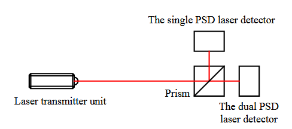

图4\.1 测试安装

测试结束后，我们在表4\.1中列出了测量值，并将其与之前单个PSD系统测量的值进行了比较。

从表4\.1可以看出，采用双PSD的激光对准系统比采用单PSD的系统精度更高。在测量范围\(±4000μm\)内，双PSD系统的方差为1\.89μm，而单PSD系统的方差为5\.33μm。因此，双PSD系统可应用于高速（接近7200rpm）旋转系统的轴对中校准（VibrAlign Inc\.,2002）。

表4\.1 测量值与先前测量值比较

刻度值（μm）

双PSD系统测量值（μm）

单PSD系统测量值（μm）

0

\-4516

\-4623

1000

\-3998

\-4008

2000

\-3001

\-3009

3000

\-1997

\-2005

4000

\-999

\-1002

5000

2

\-6

6000

1003

996

7000

2002

1995

8000

3001

3003

9000

4002

3994

10000

4438

4872

1.  结论

正如从使用千分表进行轴对中到使用激光系统进行轴对中这一理念的转变一样，此类新型的测量技术同样也需要经过一段时间，才能够被广泛地接受并成为日常实践中常规应用的方法。上述激光对中系统将有助于降低不对中率，延长平均故障间隔时间，减少维护成本，并提高生产效率。

四、外文原文

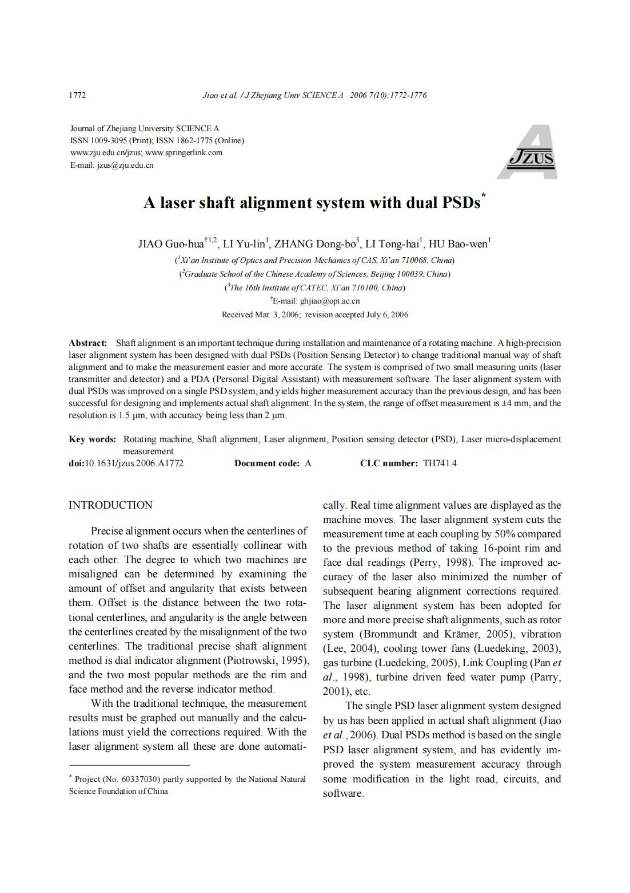

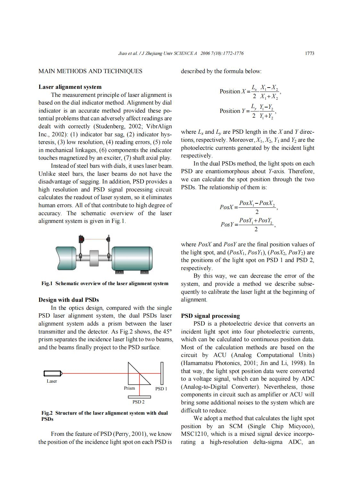

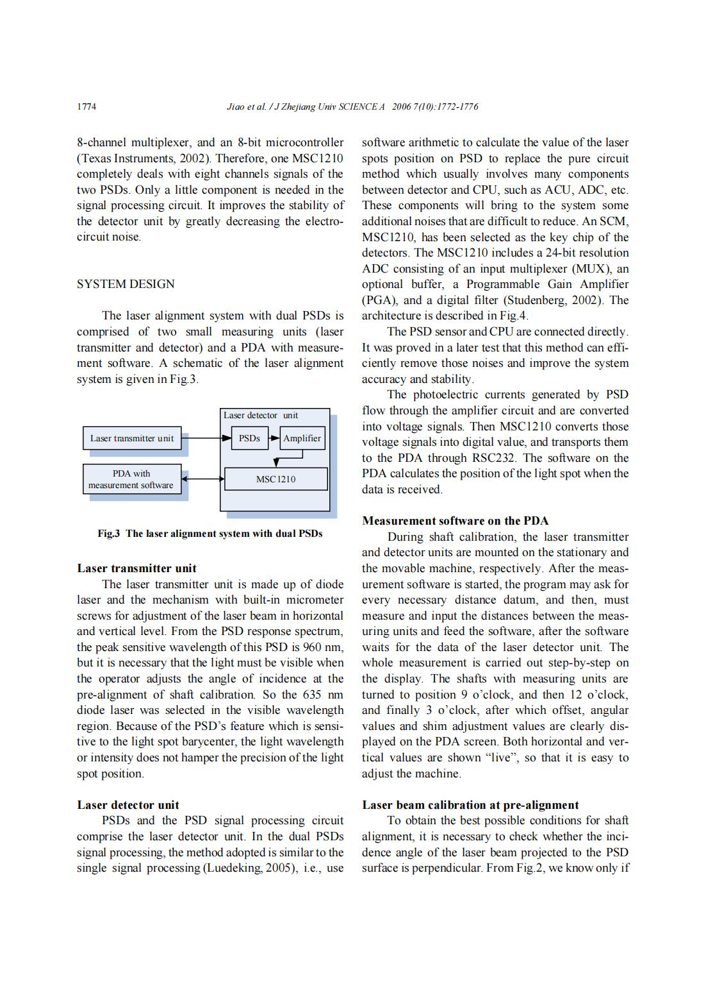

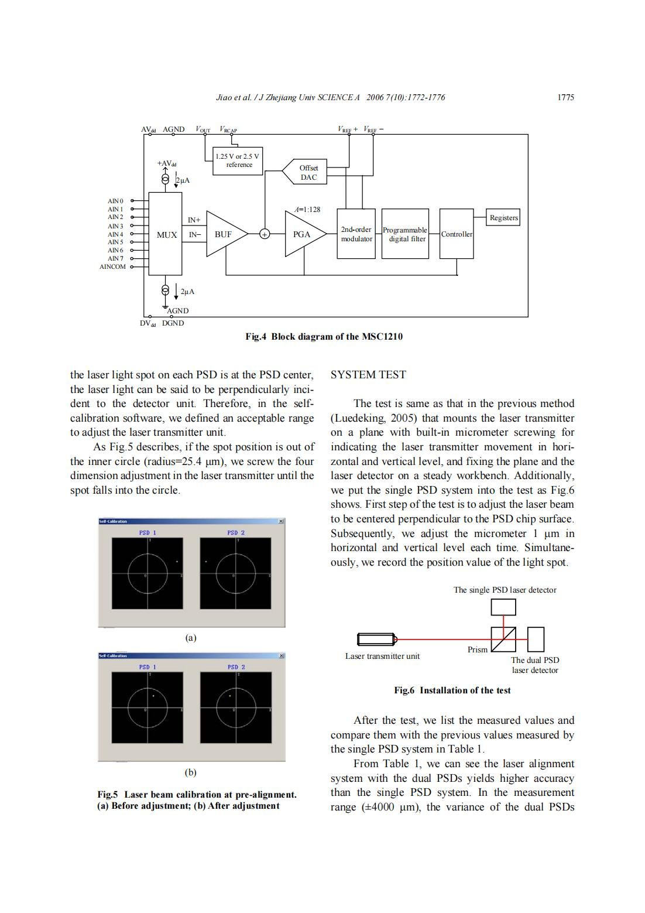

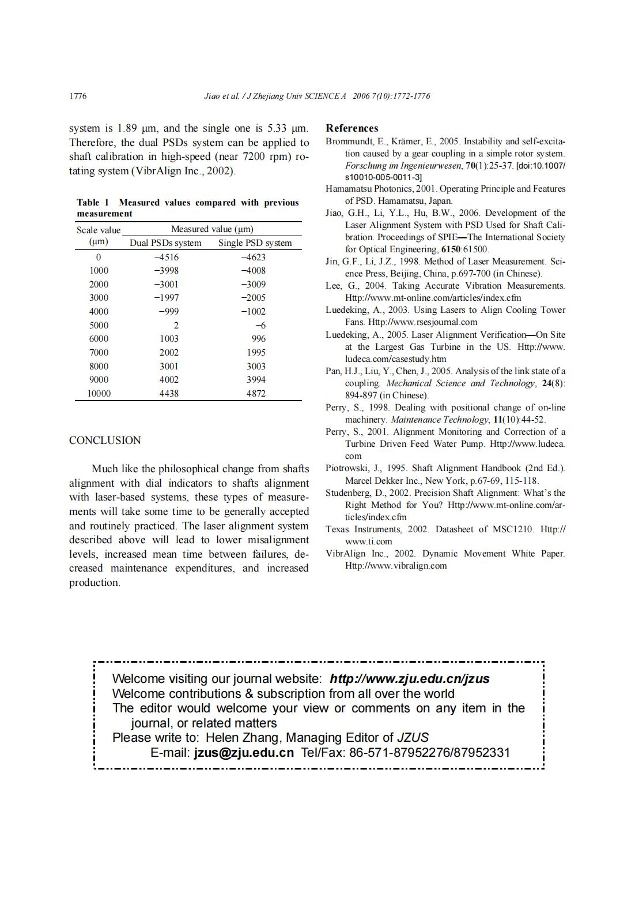

