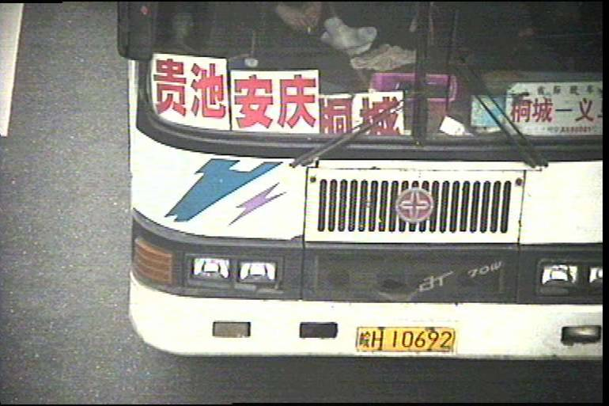

__浙江大学能源工程学院__

__本科生毕业论文（设计）__

__工作细则（2026版）__

__二〇二五年九月__

目　录

[一、毕业论文（设计）须知	1](#_Toc122508388)

[二、毕业论文（设计）目的与要求	1](#_Toc122508389)

[三、毕业论文（设计）教学进度安排	2](#_Toc122508392)

[四、毕业（论文）设计选题要求	4](#_Toc122508397)

[五、毕业论文（设计）文献综述、开题报告与答辩要求	5](#_Toc122508398)

[六、毕业论文（设计）与答辩要求	6](#_Toc122508401)

[七、毕业论文（设计）资料的存档	10](#_Toc122508405)

[八、其他说明	10](#_Toc122508406)

[附件1：文献综述、开题报告、外文翻译的内容格式](#_Toc122508407)

[附件2：毕业设计格式](#_Toc122508420)

[附件3：浙江大学本科生毕业论文（设计）专家评阅意见](#_Toc122508439)

[附件4\-1：浙江大学本科生毕业论文（设计）开题答辩记录表](#_Toc122508440)

[附件4\-2：浙江大学本科生毕业论文（设计）结题答辩记录表](#_Toc122508441)

[附件5：能源工程学院本科毕业论文（设计）中期检查表](#_Toc122508442)

一、毕业论文（设计）须知

1\.	毕业论文（设计）实行导师制，学生需全程在导师指导下完成。

2\.	毕业论文（设计）会在往年库查重，请务必遵守学术规范，切勿抄袭。

3\.	原则上毕业论文（设计）题目在公布选题后不允许个人申请更改，需由答辩委员会通过改题申请后方能更改。

二、毕业论文（设计）目的与要求

1．目的

毕业论文（设计）是高等学校本科教育人才培养计划中的重要组成部分，是本科教学过程中的重要教学实践环节，旨在培养学生综合运用本科阶段所学的基础理论、专业知识和基本技能分析和解决实际工程问题的能力，对大学生的成长及适应社会需求有着深刻影响。

2．要求

依据《浙江大学本科生毕业论文（设计）工作实施意见》（浙大本发〔2018〕3号），毕业论文（设计）要求学生在指导教师的指导下，独立完成一项给定的毕业论文（设计）任务，撰写符合要求的毕业设计或毕业论文。具体地说，在知识要求方面，应综合运用多学科的知识与技能，分析并解决工程问题，使得理论认识深化、知识领域扩展、专业技能延伸。在能力培养方面，学生应学会依据课题任务，进行资料调研、收集、加工与整理，正确使用工具书，培养学生掌握从事科学研究的基本方法和撰写技术文件的基本能力；还应掌握实验及测试的基本方法，锻炼学生分析与解决工程实际问题的能力。在综合素质要求方面，培养学生严肃认真的科学态度和严谨求实的工作作风，树立正确的工程观点、生产观点、经济观点和全局观点。

据此，毕业论文（设计）的指导教师应由具有实际设计、研究工作经验，治学严谨、工作踏实并有讲师或相当中级职称以上的人员担任。初级职称的人员原则上不单独指导毕业论文（设计），但可以协助指导教师工作。指导教师由各所安排，学院审查备案。指导教师应为人师表、教书育人，对学生严格要求。指导毕业论文（设计）应始终坚持把对学生的培养放在第一位，避免出现重使用、轻培养的现象。同时重视对学生独立工作能力、分析解决问题能力、创新能力的培养及设计思想和基本科学研究方法的指导。应注重启发引导，注重调动学生的主动性、创造性和积极性。为确保毕业论文（设计）的质量，每位指导教师所指导的学生人数应适当。

三、毕业论文（设计）教学进度安排

1．毕业论文（设计）选题

__开始时间__

__截止时间__

__工作内容__

10月9日

10月23日

学生完成毕业论文（设计）选题工作。

10月27日

学院本科教学科在学院办公网公布选题结果。

教务处规定的选课时间段

完成选课工作，学生修读《毕业论文（设计）》课程，按指导教师所在研究所选择该研究所分管本科教学副所长所带的教学班。

2．开题答辩

__开始时间__

__截止时间__

__工作内容__

10月27日

开题答辩前

指导教师教师上传任务书，学生按要求完成《文献阅读与开题报告》。

12月25日

12月31日

由各研究所组织学生进行开题答辩。学院本科教学检查督导组老师检查现场答辩情况。

12月25日

1月5日

学生根据答辩小组意见修改《文献阅读与开题报告》。

12月29日

1月7日

指导教师对《文献阅读与开题报告》进行检查确认。学生将文献综述、外文翻译、文献综述分别上传到教务系统。

2月23日

3月9日

各研究所将《文献阅读与开题报告》、开题答辩记录表、开题考核表收齐后交至学院本科生科。

3月9日

3月16日

学院本科生科检查《文献阅读与开题报告》等材料是否符合格式和装订要求，学生上传教务系统。

3．中期检查

__开始时间__

__截止时间__

__工作内容__

3月16日

3月20日

学生和指导老师完成《毕业论文（设计）中期检查表》（见附件5），上交学院本科生科，并上传系统。

3月23日

3月27日

学院本科教学科根据学校要求，组织专业教师、本科教学督导组老师等进行中期检查答辩，抽查比例为10%，抽查不合格同学无法进入结题答辩环节。

4．毕业论文（设计）答辩

__开始时间__

__截止时间__

__工作内容__

5月11日

学生将毕业论文（设计）上传至教务管理系统，由学院统一组织论文查重。

5月15日

学生提交毕业论文（设计）装订本送导师评阅、专家评阅（指导教师不能作为评阅专家）。

5月22日

各研究所组织完成毕业论文（设计）答辩。同时，学院本科教学督导组老师将检查现场答辩情况。

5月29日

各研究所审定毕业论文（设计）总评成绩比例是否符合要求，审定获得优秀毕业设计论文的质量和成果评分是否符合要求。

6月5日

1. 学生根据答辩意见进行毕业论文（设计）的修改完善。
2. 学生将修改完善并经指导老师确认的毕业论文（设计）交至各研究所。
3. 研究所收齐后将毕业论文（设计）、答辩记录表、专家评阅意见等材料交至学院本科生科。
4. 学院本科生科审核论文格式，返修。

6月10日

学生将与毕业论文（设计）装订本内容一致的电子文档（PDF版）上传到教务管理系统。

6月12日

学院检查毕业论文（设计）归档资料是否齐全、是否符合要求，合格后方能离校。

四、毕业（论文）设计选题要求

具体要求如下：

（1）毕业论文（设计）内容应紧扣生产实际，面向工程，面向社会。尽可能结合用人单位需求考虑毕业设计题目，研究本专业就业单位急需解决的难题，真题真做，提高学生分析问题和解决问题的综合能力。

（2）提倡教师与企业、设计单位联合培养学生。

（3）鼓励毕业论文（设计）题目和学生就业单位挂钩，缩短学生去单位工作的适应期。

（4）应做到一人一题。

（5）参加3\+x的学生毕业论文（设计）实行国内外双导师制，毕业设计在国外导师指导下进行，国内导师对毕设过程进行监督、把控。

（6）卓越工程师计划学生实行双导师制，在校内导师和企业导师同时指导下，并赴企业完成毕业设计。企业导师应具有中、高级以上专业技术职称。

（7）鼓励在本所完成本科毕业论文（设计），如确有跨所或跨院做毕设的需要，务必遵循双导师制，所内导师作为主导师对毕设过程对毕设过程进行监督、把控。

（8）参加毕业论文（设计）选题的学生必须在学校规定的选课时间段里，在教学管理信息服务平台选课，也即修读《毕业论文（设计）》课程，根据指导老师所在研究所选择相对应的教学班。 

五、毕业论文（设计）文献综述、开题报告与答辩要求

1．文献综述与开题报告要求

文献阅读与开题报告，主要包括文献综述、外文文献翻译、开题报告这三部分内容，统称“三合一”。文献综述要求学生广泛阅读与所从事课题相关领域的中外文文献，通过网络和深入企业实习等手段进行调研，熟悉并了解自己开展的毕业设计工作在该领域的国际、国内水平，完成文献综述；外文文献翻译要求学生对所选外文文献的重点内容进行精读并翻译；在文献综述、外文文献翻译的基础上，要求学生在开题报告中制定出毕业论文（设计）的研究设计内容、技术方案、实施步骤等。

具体要求如下：

（1）文献综述包括国内外现状、研究方向、进展情况、存在问题、参考依据等，要求查阅文献8\-10篇以上，其中外文文献不少于3篇，字数不少于3000字；内容要与毕业论文（设计）题目密切相关。开题报告包括：课题意义、背景及可行性分析、调研报告、研究方案、实施计划、预期结果，要求字数不少于3500字。外文文献翻译译文正文要求字数不少于3000字。

（2）__毕业设计采用导师制。每一位毕业设计指导教师应在学生确定毕业设计选题后，一周内召集学生见面，下发书面的毕业论文（设计）任务书，提出所做课题的要求。指导教师应加强对学生毕业论文（设计）过程管理。定期检查学生的工作进度和质量，与学生进行交流、讨论、答疑和指导，对学生的指导时间每周不少于４小时。认真指导，严格把关。__

（3）成册要求：三合一文件无需装订，整理成册顺序为：1\.封面，2\.题目、指导教师对文献综述与开题报告具体内容要求，3\.目录，4\.文献综述，5\.开题报告，6\.外文翻译，7\.外文原文，8\.考核评语及成绩评定（见附件1）。

（4）打印要求：正文用A4纸双面打印（封面、内容要求、目录、考核评语及成绩评定需__每项单独__打印，切勿将其中两项打印在正反两面，若其中某一项超出两页需双面打印）。封面严格按照附件要求的格式填写，采用普通A4纸打印即可。

2．开题答辩要求

（1）学生在文献综述与开题报告完成后必须按规定时间进行答辩。

（2）各研究所成立答辩委员会，下设答辩小组。答辩小组人数以3\-5名为宜，成员应由中级及以上职称并有较强的业务能力和工作能力的人员担任，答辩组长应由高级职称教师担任，也可聘请外单位副高级以上职称人员参加。

（3）指导教师对学生的文献综述与开题报告进行认真、全面审查。

（4）答辩小组应根据学生文献综述、毕业论文（设计）的研究设计内容、技术方案、实施步骤等内容，准备好不同难易程度的问题，在答辩时进行提问。答辩时间：一般为20分钟，学生介绍陈述为10分钟，提问和回答问题约10分钟。

（5）答辩小组需做好开题答辩记录表（见附件4\-1），要求在答辩陈述和问题回答等方面具体加以记录与评价。

（6）答辩结束后，答辩小组应对学生的文献综述与开题报告及答辩情况撰写书面评语、给出总体成绩并签字、写日期。答辩小组负责人与指导教师为同一人时，要分开写评语，并且不能由同一人签名，答辩小组负责人可换同组其他老师签。

六、毕业论文（设计）与答辩要求

1．毕业论文（设计）要求

学生在指导教师的指导下，完成毕业论文（设计）的书面报告。

具体要求如下：

__1\.1 毕业论文（设计）格式要求：__

封面、目录。

正文标题：题目简要、明确，一般不宜过长。

中外文摘要及关键词：简要概括论文的主要内容和观点。中文摘要300~600字以内，英文摘要实词300个左右。摘要最后另起一行，列出3\-8个关键词。

毕业论文（设计）字数为1万字以上。

参考文献格式：

著作：顺序编码、作者、书名、出版社、出版时间。

论文：顺序编码、作者、论文篇名、刊号、年、卷（期）、页码。

毕业论文（设计）应单独成册，使用统一封面。

参考文献不得少于10篇，具体格式见附件2。

__1\.2 毕业论文（设计）排版及成册顺序：__

毕业论文（设计）排版及成册顺序为：1\.封面，2\.诚信承诺书，3\.致谢，4\.中英摘要，5\.目录，6\.论文正文，7\.参考文献，8\.作者简介（可省略），9\.本科生毕业论文（设计）任务书，10\.毕业论文（设计）考核表。

毕业论文（设计）正文用A4纸双面打印（1\-5、8\-10需每项单独打印，切勿将其中两项打印在正反两面，若其中某一项超出一页需双面打印）。封面严格按照附件要求的格式填写，采用普通A4纸打印即可。

注：图纸等其它无法装订的资料以附件一、二形式，装入“本科生毕业论文”资料袋。附件一（将毕业论文（设计）完成的图转换为PDF格式作为论文附件）、附件二（相关成果：论文录用通知书，或正式发表论文期刊封面、目录、全文，或申请专利受理通知书等）。

__1\.3 毕业论文（设计）查重检测__

（1）毕业论文（设计）查重率在10%以下者为通过，学生应根据检测报告做适当修改。

（2）毕业论文（设计）查重率高于10%者，需指导教师督促修改并确认，在规定时间内重新提交毕业论文（设计），由学院组织第二次查重。

（3）二次查重率仍高于10%者，指导教师担保不存在学术不端行为且经学院本科教学委员会审核同意，方可进行论文送审。

（4）二次查重仍不通过者，毕业论文（设计）不予送审，不参加统一答辩。

2．毕业论文（设计）答辩要求

（1）学生在毕业论文（设计）完成后必须按规定时间进行答辩。答辩前研究所必须对学生进行答辩前的资格审查。

（2）各研究所成立答辩委员会，下设答辩小组。答辩小组人数以3\-5名为宜，成员应由中级及以上职称并有较强的业务能力和工作能力的人员担任，答辩组长应由高级职称教师担任，也可聘请外单位副高级以上职称人员参加。

（3）指导教师对学生的毕业论文（设计）进行认真、全面审查，对学生的毕业论文（设计）的完成情况及水平、工作能力、工作态度写出评语。

（4）各研究所组织学生毕业论文（设计）的送审评阅环节，评阅专家填写毕业论文（设计）专家评阅意见表（见附件3）。未通过专家评阅者，不得进行毕业论文（设计）答辩。

（5）答辩小组应根据课题涉及的内容和要求，以有关基本概念、基本理论为主，准备好不同难易程度的问题，在答辩时进行提问。答辩时间：一般为25分钟，学生介绍陈述为15分钟，提问和回答问题约10分钟。

（6）答辩小组需做好答辩记录表（见附件4\-2），要求在答辩陈诉和回答问题等方面具体加以记录与评价。

（7）答辩结束后，答辩小组应对学生的毕业论文（设计）内容及答辩情况撰写书面评语、给出总体成绩并签字，写日期。答辩小组负责人与指导教师为同一人时，要分开写评语，并且不能由同一人签名，答辩小组负责人可换同组其他老师签。

3．毕业论文（设计）质量评分

（1）毕业论文（设计）质量评分依据

每位参加毕业论文（设计）答辩的学生用多媒体课件向答辩小组汇报毕业论文（设计）的工作情况，回答答辩小组成员的提问，然后由答辩小组指导教师根据以下五个方面综合评定毕业论文（设计）成绩，并填写毕业论文（设计）现场答辩记录表。

① 学生完成《文献阅读与开题报告》质量（包括基础理论、专业知识、外文水平、动手能力）；

② 毕业论文（设计）总体质量（包括选题、毕业论文（设计）任务工作量和完成情况、毕业设计说明书（论文）质量、文字表达、创新等诸方面）；

③ 答辩中自述和回答问题的情况；

④ 全过程的工作态度；

⑤ 纪律及考勤情况。

（2）毕业论文（设计）质量评分标准

优秀：按期圆满完成任务书规定的任务，并在某些方面有独特的见解与创新。毕业设计报告（论文）立论正确、内容完整，计算与分析论证可靠、严密，结论合理，文字条理清楚、书写工整。说明书、图纸符合规范，质量高，完成的软、硬件达到甚至优于规定的性能指标且文档齐全、规范。独立工作能力强，答辩时概念清楚，回答问题正确。

良好：能较圆满完成任务书规定的任务，毕业设计报告（论文）立论正确、内容完整，计算与分析论证基本正确，结论合理。文字条理清楚、书写工整，说明书、图纸符合规范，质量较高。完成的软、硬件基本达到规定的性能指标且文档齐全、规范，独立工作能力较强。答辩时概念较清楚，回答问题基本正确。

中等：能完成任务书规定的任务，毕业设计报告（论文）内容基本完整，计算与论证无原则性错误，结论基本合理。说明书、图纸量一般，完成的软、硬件尚能达到规定的性能指标，文档基本齐全，基本符合规范，工作能力一般。答辩时能回答所提出的主要问题，且基本正确。

及格：基本完成任务书规定的任务，毕业设计报告（论文）质量一般，只存在个别非原则性错误。说明书、图纸尚完整，完成的软、硬件性能一般，答辩时讲述大致清楚，回答问题存在不确切之处。

不及格：未完成任务书规定的任务，工作态度不认真，毕业设计报告（论文）有原则性错误。说明书、图纸质量较差，完成的软、硬件性能差。答辩时概念不清，回答问题不正确。

（3）毕业论文（设计）质量评分比例

各专业毕业论文（设计）总评成绩评定比例应按各专业的学生人数，优秀（90～100）控制在25%以内，良好（80～89）控制在55%以内，其余为中等（70～79）、及格（60～69）和不及格（59及以下）。

七、毕业论文（设计）资料的存档

毕业论文（设计）归档材料包括：

（1）毕业论文（设计）完整本（含任务书、考核表）；

（2）毕业论文（设计）文献综述与开题报告完整本（含考核表）；

（3）毕业论文（设计）开题答辩记录表；

（4）毕业论文（设计）中期检查表；

（5）毕业论文（设计）答辩记录表；

（6）毕业论文（设计）专家评阅意见（指导教师不能作为评阅专家）；

（7）文献阅读与开题报告、毕业论文（设计）及附件等所有材料电子版上传至教务管理系统。

八、其他说明

（1）附件中小括号内文字为说明性文字，请自行修改、删除。

（2）本细则未尽事宜由学院本科教学委员会讨论确定实施方案。

（3）本细则最终解释权归浙江大学能源工程学院。

附件1：文献综述、开题报告、外文翻译的内容格式

____

__本 科 生 毕 业 论 文（设计）__

文献综述和开题报告

__题目__

XXXXXXXXXXXXXXXXXXXXXXXXXXXXXXXX（题目中多余横线自行删去）

__姓名与学号__

    XXX  321010XXXX      

__指导教师__

    XXX                  

__年级与专业__

　　2022级XXXXX（根据毕业证书的专业填写）                                         

__所在学院（系）__

　　能源工程学院           

一、题目

XXXXXXXXXXXXXXXXXXXXXXXXXXXXXXX（题目中多余横线自行删去）

二、指导教师对文献综述和开题报告的具体内容要求：

1. XXX（根据实际内容长度自行调整格式，要求写明研究内容的具体要求，切勿宽泛，按条罗列，占满篇幅）

指导老师（签名）：             

年　　月　　日

目　录

[一、文献综述	1](#_Toc82277988)

[1  背景介绍	1](#_Toc82277989)

[1\.1  标题	1](#_Toc82277990)

[2  国内外研究现状	1](#_Toc82277991)

[2\.1  研究方向及进展	1](#_Toc82277992)

[2\.2  存在问题	1](#_Toc82277993)

[3  研究展望	1](#_Toc82277994)

[4  参考文献	1](#_Toc82277995)

[二、开题报告	3](#_Toc82277996)

[1  问题提出的背景	3](#_Toc82277997)

[1\.1  背景介绍	3](#_Toc82277998)

[1\.2  本研究的意义和目的	3](#_Toc82277999)

[2  论文的主要内容和技术路线	3](#_Toc82278000)

[2\.1  主要研究内容	3](#_Toc82278001)

[2\.2  技术路线	3](#_Toc82278002)

[2\.3  可行性分析	3](#_Toc82278003)

[3  研究计划进度安排及预期目标	3](#_Toc82278004)

[3\.1  进度安排	3](#_Toc82278005)

[3\.2  预期目标	3](#_Toc82278006)

[4  参考文献	3](#_Toc82278007)

[三、外文翻译	4](#_Toc82278008)

[四、外文原文	5](#_Toc82278009)

一、文献综述（居中、小二号宋体加粗）

1  背景介绍（和编号空一个字、小三号宋体加粗）

××××××××××××\(小四号宋体，1\.5倍行距，英文、数字使用Times New Roman，正文注意首行缩进两字符\)

1\.1  标题（和编号空一个字、四号宋体加粗）

1\.1\.1  标题（和编号空一个字、四号宋体加粗）

××××××××××××××××××××××××××××××××××××××××××××××××××\(小四号宋体，1\.5倍行距，英文、数字使用Times New Roman\)

正文表格和图片标题均采用五号宋体加粗，表题居表上居中，图题居图下居中。表格中文字采用五号宋体，行距为单倍行间距，英文、数字使用五号Times New Roman。表格和图片与上下文空一行。（样例见附件2毕业论文格式）

2  国内外研究现状

2\.1  研究方向及进展（该标题仅供参考，写作时可自行更换）

2\.2  存在问题（该标题仅供参考，写作时可自行更换）

3  研究展望

4  参考文献

“参考文献”四字采用小三号宋体加粗，后面所附的文献遵照《信息与文献 参考文献著录规则》GB/T7714\-2015，所有被引用文献均要列入参考文献表中，并采用顺序编码制组织。文献排列顺序按照在论文正文中出现的先后循序进行，并在正文中将参考文献引用的位置右上角标标注出来，二者编号应保持一致。参考文献8\-10篇以上，外文不少于3\-5篇。参考文献中文采用五号宋体，英文和数字采用五号Times New Roman，行间距为单倍行距，格式为两端对齐。

参考文献格式示例如下（__分类只做示意，实际引用时请勿分类__）：

__著作图书__

\[1\] 刘国钧, 陈绍业, 王凤哲\. 图书馆目录\[M\]\. 北京：高等教育出版社, 1957\.

\[2\] 机械工程手册编委会\. 机械工程手册：第六卷传动设计卷\[M\]\. 北京：机械工业出版社, 1997\.

\[3\] ENGEL P A\. Impact Wear of Materials\[M\]\. 2nd ed\. New York: Elsevier, 1986\.

__翻译图书__

\[4\] 拉达伊D\. 焊接热效应:温度场与变形\[M\]\. 熊第京等译\. 北京：机械工业出版社, 1997\.

__期刊论文__

\[5\] 陶仁骥\. 密码学与数学\[J\]\. 自然杂志, 1984, 7: 527\-534\+560\.

\[6\] WATANABE H, SHOJI Y, YAMAGAKI T, et al\. Secondary Atomization and Spray Flame Characteristics of Carbonated W/O Emulsified Fuel\[J\]\. Fuel, 2016,182: 259\-265\.

__学位论文__

\[7\] 张筑生\. 微分半动力系统的不变集\[D\]\. 北京:北京大学,1983\.

\[8\] ROCHA J\. Secondary Atomization of Inelastic Non\-newtonian Liquid Drops in the Bag and Multimode Regimes\[D\]\. Ann Arbor: Purdue University, 2016\.

__专利__

\[9\] 刘海云\. 利用排序产生的序号码加密的方法及密码机:200910147454\.0\[P\]\. 2009\-10\-28\.

电子资源（不包括电子专著、电子连续出版物、电子学位论文、电子专利）

\[10\] 董辅礽\. MBO全面推广尚有困难\[EB/OL\]\. \(2002\-12\-12\) \[2003\-04\-07\]\. [http://www\.china\.com\.cn/chi](http://www.china.com.cn/chinese/FI-c/245710.htm)[nese/FI\-c/245710\.htm](http://www.china.com.cn/chinese/FI-c/245710.htm)\.

注意：

（1）各项目之间的标点符号用Times New Roman小黑点“\.”,每一条参考文献的结尾可用“\.”号；

（2）外文文献名第一个词首字母和每个实词的第一个字母大写，余为小写；

（3）编著者不超过三位时，可全部照录；超过三位时，只著录三位，其后加“等”字或其他与之相应的外文字；

（4）参考文献在正文中的表示方法是：序号加方括号，写在有关正文的右上角，如“二次铣削\[1, 2, 3\-5\]”。但提及的参考文献为文中的说明时，则文献序号应与正文平排，如“由参考文献\[4, 8, 10\-14\]可知”。

（5）个人著者，其姓全部著录，字母全大写，名可缩写为首字母；如用首字母无法识别该人名时，则用全名。采用姓在前名在后的著录形式。欧美著者的名可用缩写字母，缩写名后省略缩写点。欧美著者中的译名只著录其姓；同姓不同名的欧美著者，其中译名不仅要著录其姓，还需著录其名的首字母。

（6）附录中参考文献需另行编排序号，与正文分开，也一律用阿拉伯数字编码。

二、开题报告

（正文格式与一、文献综述相同）

1  问题提出的背景

1\.1  背景介绍

1\.1\.1  标题

1\.2  本研究的意义和目的

2  论文的主要内容和技术路线

2\.1  主要研究内容

2\.2  技术路线

2\.3  可行性分析

3  研究计划进度安排及预期目标

3\.1  进度安排

3\.2  预期目标

4  参考文献

三、外文翻译

（正文格式与一、文献综述相同）

四、外文原文

（可Word、PDF或图片，但页面要填满，比例协调，可不另编页码）

__毕业论文（设计）文献综述和开题报告考核__

1. 对文献综述、外文翻译和开题报告评语及成绩评定：

成绩比例

文献综述

占（10%）

开题报告

占（15%）

外文翻译

占（5%）

分　值

（总分30）

开题报告答辩小组负责人（签名）：             

年　　月　　日

附件2：毕业设计格式

____

__本 科 生 毕 业 论 文（设计）__

__题目__

XXXXXXXXXXXXXXXXXXXXXXXXXXXXXXXX（题目中多余横线自行删去）

__姓名与学号__

　　XXX 321010XXXX        

__指导教师__

　　XXX                         

__年级与专业__

　　2022级XXXXX（根据毕业证书的专业填写）                                         

__所在学院（系）__

　　能源工程学院           

__毕业论文（设计）原创性声明（单面打印）__

1. 本人郑重声明：所呈交的毕业论文（设计）是本人在导师的指导下，严格按照学校和学院有关规定完成的，不存在学术不端行为。除文中特别加以标注和致谢的地方外，本论文（设计）不包含其他个人或集体已经发表或撰写过的研究成果，也不包含为获得__ 浙江大学 __或其他教育机构的学位或证书而使用过的材料。对本研究做出贡献的个人和集体，均已在文中明确说明并表示谢意。

               毕业论文（设计）作者签名：

                               签字日期：     年   月   日

__毕业论文（设计）使用授权书__

1. 本人完全了解__ 浙江大学 __有权保留并向国家有关部门或机构送交本论文（设计）的复印件和电子版，允许本论文（设计）被查阅和借阅。本人授权 __浙江大学__ 可以将本论文（设计）的全部或部分内容编入有关数据库进行检索和传播，可以采用影印、缩印或扫描等复制手段保存、汇编本论文（设计）。
2. （涉密毕业论文（设计）在解密后适用本授权书。）

毕业论文（设计）作者签名：               导师签名：

签字日期：    年   月   日        签字日期：    年   月   日

致  谢

（居中，小二号宋体加粗）

\(正文采用小四号宋体、1\.5倍行距、英文和数字使用Times New Roman，300字以上\)

采用新型混合制冷剂的非机械功驱动深度冷冻系统研究

王世宽

浙江大学能源工程学院  杭州  310007

摘  要

能源与环境问题已经成为当今社会人们最受关注的话题之一，扩散吸收式制冷机无需任何机械功驱动便可依靠热能运行，对深度冷冻系统发展具有重要意义。传统的扩散吸收式制冷循环通常采用氨/水/氢为工质，但受工质物性的限制，无法实现深度制冷。在对国内外扩散吸收式制冷文献进行分析总结的基础上，本文提出了采用新型混合制冷剂R23/R227ea，以DMF为吸收剂，以He为平衡气体的扩散吸收式制冷系统，实现非机械功驱动的深度冷冻的目的。

本文对此系统进行了理论和实验研究，阐述了扩散吸收制冷系统的研究背景、基本原理以及研究历史与研究现状，在此基础上明确了本文的研究意义和主要的研究内容, 详细介绍了采用新型混合制冷剂扩散吸收制冷循环的工作原理与特点，并对其进行了热力模拟计算，分析研究各参数变化对系统性能的影响, 对系统部件的布置方式进行设计，并绘制了气泡泵和气液分离器装配图以及系统各部件的相对位置布置图。

（摘要应具有独立性和自含性，即不阅读论文全文就能获得必要信息。摘要的内容应包含与论文等同量的主要信息，供读者确定有无必要阅读全文，也可供二次文献采用。摘要应说明研究目的、方法、结果和结论等，重点是结果和结论。中文摘要的字数一般为300\-600字以内，英文摘要实词在300个左右。英文摘要应与中文摘要内容相对应。英文题目和关键词，实词首字母大写）

__关键词__：扩散吸收；混合制冷剂；模拟计算；实验；性能（3～8个关键词）

Study on the Low Temperature Refrigeration System Operating with New Mixed Refrigerants without Mechanical Work Input

Wang Shikuan

College of Energy Engineering, Zhejiang University, Hangzhou 310007

Abstract

Energy and environment attracts attentions of people nowadays\. It is significant for the refrigeration system to reach low temperature that the diffusion absorption refrigerator \(DAR\) doesn’t need any mechanical work input but heat\. The conventional DAR uses ammonia/water/hydrogen as the working substance, which is unable to reach low temperature due to the confine of the thermodynamic properties of the working substance\. Based on the review and analysis of DAR systems at home and abroad, this paper investigated a new DAR system to reach low temperature operating with binary refrigerant R23/R32/R134a, DMF as absorbent, He as inert gas\. 

Theoretical and experimental studies are conducted on the new system\. Main contents of the research are as follows: A review of the development of the DAR cycle and research status of the working substances of the DAR\. The operating principle and features of the new DAR cycle operating with binary refrigerant were presented\. The influences of different parameters on the performance of the system were analyzed in detail after simulation and calculation\. The layouts of the components of the system were designed\. The structural diagram of the bubble pump with separator and the layout of the system were drawn\.

__Keywords：__Diffusion Absorption; Mixed Refrigerant; Simulation; Experiment; Performance

目　录

[致  谢	I](#_Toc82282798)

[摘  要	II](#_Toc82282799)

[Abstract	III](#_Toc82282800)

[1  绪论（引言）	1](#_Toc82282801)

[1\.1  背景	1](#_Toc82282802)

[1\.1\.1  □□□□□	1](#_Toc82282803)

[1\.2  已往的研究	1](#_Toc82282804)

[1\.3  最新的研究成果	1](#_Toc82282805)

[1\.4  本文的主要内容	1](#_Toc82282806)

[2  主体内容一	2](#_Toc82282807)

[2\.1  主题内容一的展开	2](#_Toc82282808)

[3  主题内容二	3](#_Toc82282809)

[3\.1主题内容二的展开	3](#_Toc82282810)

[3\.2  主题内容二的继续展开	4](#_Toc82282811)

[4  主题内容三	5](#_Toc82282812)

[4\.1  主题内容三的展开	5](#_Toc82282813)

[5  总结	7](#_Toc82282814)

[参考文献	8](#_Toc82282815)

[作者简介	10](#_Toc82282816)

附件一：图纸等材料名称

附件二：图纸等材料名称

（注：图纸等其它无法装订的资料以附件一、二形式，装入“本科生毕业论文”资料袋。）

1  绪论（引言）（和编号空一个字、小二号宋体加粗）

（应包括论文的研究目的、流程和方法等。论文研究领域的历史回顾、文献回溯、理论分析等内容，应独立成章，用足够的文字叙述。）

1\.1  背景（和编号空一个字、小三号宋体加粗）

1\.1\.1  □□□□□（和编号空一个字、四号宋体加粗）

×××××××××××××××××××××××××××××××××××××××××××××\(小四号宋体、1\.5倍行距、英文和数字使用Times New Roman，正文注意首行缩进两个字符\)

1\.2  已往的研究（该标题仅供参考，写作时可自行更换）

1\.3  最新的研究成果（该标题仅供参考，写作时可自行更换）

图1\.1 典型的汽车牌照图像\(表名图名均为五号宋体\)

1\.4  本文的主要内容

2  主体内容一（和编号空一个字、小二号宋体加粗）

2\.1  主题内容一的展开（和编号空一个字、小三号宋体加粗）

__有关图的说明__

（1）图的图号应在文中引出，以先见文后见图为原则。

（2）图号一般按章编排，如第1章第1图，可写成图1\.1；第2章第2图，可写成图2\.2。附录中的图，用图A1、B1等。

（3）每一图应有简短确切的图名，图名与图号间空一格。图名后不加标点。图名连同图号置于图下居中书写。

（4）图标题（图名与图号）与图之间无需空行，但图上方、图下方与正文要有一行的间距，也可根据排版需要适当调	整图与正文之间的间距。

（5）图号与图名一律用宋体五号字加粗；如果图中有文字，则采用五号字，宋体，凡是英文或数字均采用Times New Roman。

（6）必要时，应将图中的符号、标记、代码，以及实验条件，以最简练的文字，横排于图标题下，作为图例说明，当有分图号时，应写在图标题之下，图例说明之上。图框中的分图号用a）、b）表示。正文中引用时，用“见图1\.1a、b”或“如图1\.1a、b所示”。

（7）曲线图的纵横坐标必须标注“量、标准规定符号、单位”。此三者只有在不必要标明（如量纲等）的情况下方可省略。坐标上标注的量的符号和缩略词必须与正文中一致。

（8）照片图要求主题和主要显示部分的轮廓鲜明，便于制版。如用放大缩小的复制品，必须清晰，反差适中。照片上应该有表示目的物尺寸的标度。

（9）图应有自明性。（即只看图，图名和图例说明，不阅读正文，就可以理解图意）

3  主题内容二

3\.1主题内容二的展开

__有关表的说明__

（1）表的表号应在文中引出，以先见文后见表为原则。

（2）表号一般按章编排，如第1章第1表，可写成表1\.1；第2章第2表，可写成表2\.2。附录中的表，用表A1、B1等。

（3）每一表应有简短确切的表名，表名与表号间空一格。表名后不加标点。表名连同表号置于表上，居中书写。

（4）表标题（表名与表号）与表之间无需空行，但表上方、表下方与正文要有一行的间距，也可根据排版需要适当调整表与正文之间的间距。

（5）表号与表名一律用宋体五号字加粗；表中内容与表注，中文采用宋体，凡是英文或数字均采用Times New Roman，字号为五号，行距为单倍行间距。

__（6）表不设左右边框，上下边框必须具备并加粗，其它框线根据表中内容自行设定，原则上使用国际通用三线表格。__

（7）必要时，应将表中的符号、标记、代码，以及需要说明事项，以最简练的文字，横排于表标题下，作为表注，也可以附注于表下，附注前空两格写出阿拉伯数字圈码（如注：①），后空一格写注文，同时在表中加注之处的右上角加一相应的圈码（如①、②等）。

（8）表的各栏均应标明“量或测试项目、标准规定符号、单位”。如果全表内都用一种计量单位，则可将单位移至表头（即表的第一行）右上角书写。只有在无必要标注的情况下方可省略。表中的缩略词和符号，必须与正文中一致。

（9）表内同一栏的数字必须上下对齐。表内不宜用“同上”、“同左”、“…”和类似词，一律填入具体数字或文字。表内“空白”代表未测或无此项，“—”或“……”代表未发现，“0”代表实测结果确为零。

（10）同一表格需要转页时，在随后的各页上应重复表的编号。编号后跟表题（可省略）和“（续）”，置于表上方。续表均应重复表头。

（11）表应有自明性。（即只看表，表名，不阅读正文，就可以理解表意）

例：

表3\.1 不同流道的电池效率

库伦效率

电压效率

能量效率

蛇型流道

92\.06%

82\.66%

76\.10%

交叉流道

88\.40%

75\.94%

67\.13%

若跨页

表3\.1 （续）

库伦效率

电压效率

能量效率

蛇型流道

92\.06%

82\.66%

76\.10%

交叉流道

88\.40%

75\.94%

67\.13%

3\.2  主题内容二的继续展开

4  主题内容三

4\.1  主题内容三的展开

__有关公式的说明__

（1）公式缩格书写。若公式前有简短的文字说明（如解、证、令、假定、由此得等），文字顶格书写，公式末不加标点。

（2）公式序号写在公式右侧行末顶边线，并加圆括号。（当有续行时，应标注于最后一行的行末顶边线）公式与序号之间不加连点线。

（3）公式较长必须转行时，只能在＋，－，±，×，÷，＜，＞等符号后断开，而在下一行开头不应重复这一符号。上下式尽可能在符号“＝”处对齐。

（4）公式序号一般按章编排，如第1章第1公式，可写成（1\.1）；第2章第2公式，可写成（2\.2）。附录中的公式，用\(A1\)、\(B1\)等,编排号（1\.1）采用Times New Roman。

（5）文中引用公式时，一般用“见式（1\.1）”、“见式（2\.1）～（2\.4）”。

（6）公式与正文间要有一定的间距，可根据排版需要适当调整。

（7）小数点用“\.”来表示。大于999的整数和多余三位数的小数，一律用半个阿拉伯数的小间隔分开，不用千位撇。对于纯小数应将零列于小数点之前。示例： 

应该写成94 652\.023 567；0\.314 325

不应写成94,652\.023,567；0\.314,325

（8）应注意区别各种字符，如拉丁文、希腊文、俄文、德文花体、草体；罗马数字和阿拉伯数字；字符的正斜体、黑白体、大小写、上下角标（特别是多层次，如“三踏步”）、上下偏差等。

（9）公式及式中物理量的注释的书写格式采用下列注释方法：

如对于公式：

*P*=*KFv*/1000*η*	（4\.1）

注释方式为：

式中：	*P*——电动机功率，单位为kW；

	*K*——安全系数，*K*=1\.2～1\.5；

	*F*——链传动限力式辊子输送机积放状态下链条的最大牵引力，单位为N；

	*v*——输送速度，单位为m/s；

*	η*——驱动装置效率，*η*=0\.65～0\.85。

5  总结

论文的结论是最终的、总体的结论。结论应包括论文的核心观点，交代研究工作的局限，提出未来工作的意见或建议。结论应该准确、完整、明确、精炼。如果不能导出一定的结论，也可没有结论而进行必要的讨论。

参考文献

“参考文献”四字采用小二号宋体加粗，后面所附的文献遵照《信息与文献 参考文献著录规则》GB/T7714\-2015，所有被引用文献均要列入参考文献表中，并采用顺序编码制组织。文献排列顺序按照在论文正文中出现的先后循序进行，并在正文中将参考文献引用的位置标注出来，二者编号应该保持一致。参考文献中文采用五号宋体，英文采用五号Times New Roman，行间距为单倍行距，格式为两端对齐。参考文献格式示例如下：

__著作图书__

\[1\] 刘国钧, 陈绍业, 王凤哲\. 图书馆目录\[M\]\. 北京：高等教育出版社, 1957\.

\[2\] 机械工程手册编委会\. 机械工程手册：第六卷传动设计卷\[M\]\. 北京：机械工业出版社, 1997\.

\[3\] ENGEL P A\. Impact Wear of Materials\[M\]\. 2nd ed\. New York: Elsevier, 1986\.

__翻译图书__

\[4\] 拉达伊D\. 焊接热效应:温度场与变形\[M\]\. 熊第京等译\. 北京：机械工业出版社, 1997\.

__期刊论文__

\[5\] 陶仁骥\. 密码学与数学\[J\]\. 自然杂志, 1984, 7: 527\-534\+560\.

\[6\] WATANABE H, SHOJI Y, YAMAGAKI T, et al\. Secondary Atomization and Spray Flame Characteristics of Carbonated W/O Emulsified Fuel\[J\]\. Fuel, 2016,182: 259\-265\.

__学位论文__

\[7\] 张筑生\. 微分半动力系统的不变集\[D\]\. 北京:北京大学,1983\.

\[8\] ROCHA J\. Secondary Atomization of Inelastic Non\-newtonian Liquid Drops in the Bag and Multimode Regimes\[D\]\. Ann Arbor: Purdue University, 2016\.

__专利__

\[9\] 刘海云\. 利用排序产生的序号码加密的方法及密码机:200910147454\.0\[P\]\. 2009\-10\-28\.

电子资源（不包括电子专著、电子连续出版物、电子学位论文、电子专利）

\[10\] 董辅礽\. MBO全面推广尚有困难\[EB/OL\]\. \(2002\-12\-12\) \[2003\-04\-07\]\. [http://www\.china\.com\.cn/chinese/FI\-c/245710\.htm](http://www.china.com.cn/chinese/FI-c/245710.htm)\.

注意：

（1）各项目之间的标点符号用Times New Roman小黑点“\.”,每一条参考文献的结尾可用“\.”号；

（2）外文文献名第一个词首字母和每个实词的第一个字母大写，余为小写；

（3）编著者不超过三位时，可全部照录；超过三位时，只著录三位，其后加“等”字或其他与之相应的外文字；

（4）参考文献在正文中的表示方法是：序号加方括号，写在有关正文的右上角，如“二次铣削\[1, 2, 3\-5\]”。但提及的参考文献为文中的说明时，则文献序号应与正文平排，如“由参考文献\[4, 8, 10\-14\]可知”。

（5）个人著者，其姓全部著录，字母全大写，名可缩写为首字母；如用首字母无法识别该人名时，则用全名。采用姓在前名在后的著录形式。欧美著者的名可用缩写字母，缩写名后省略缩写点。欧美著者中的译名只著录其姓；同姓不同名的欧美著者，其中译名不仅要著录其姓，还需著录其名的首字母。

（6）附录中参考文献需另行编排序号，与正文分开，也一律用阿拉伯数字编码。

作者简介（居中，小二号宋体加粗）

（正文采用小四号宋体、1\.5倍行距、英文使用Times New Roman）

（包括教育经历、工作经历、攻读学位期间发表的论文和完成的工作等，若无相关经历可省略此部分，作者简介页可省略）

（打印时另起新的一页，不能放反面）

__本科生毕业论文（设计）任务书__

一、题目：                                          

二、指导教师对毕业论文（设计）的任务要求及进度安排：

任务要求：

1、

2、

    

进度安排：

1、

2、

起讫日期 2025年   月   日 至 2026年   月   日

指导教师（签名）          

三、系或研究所审核意见:

负责人（签名）          

 年   月   日

__毕 业 论 文（设计）  考 核__

一、指导教师对毕业论文（设计）的评语：

    

指导老师（签名）             

年　　月　　日

二、答辩小组对毕业论文（设计）的答辩评语及总评成绩：

成绩比例

文献综述

占

（10%）

开题报告

占（15%）

外文翻译占

（5%）

毕业论文（设计）

质量及答辩

占（70%）

总评

成绩

分值（总分70）

答辩小组负责人（签名）             

年　　月　　日

附件3

浙江大学本科生毕业论文（设计）专家评阅意见

毕业论文（设计）题目

学生姓名

学 号

年级

所在学院

专业

指导教师姓名

职 称

所在单位

本科生毕业论文（设计）评阅意见：（对论文选题、研究内容与方法、创新点、论文质量与理论水平、论文写作规范与文风和修改建议等方面加以评阅）

同意答辩

同意修改后答辩

未达到答辩要求

评阅人签名

评阅人职称

评阅人单位

注：请评阅专家经综合评价后，在相应栏内打“√”。

附件4\-1

浙江大学本科生毕业论文（设计）开题答辩记录表

学院：能源工程学院	毕业届别：2024

学生姓名

学号

专业

毕业论文（设计）题目

指导教师姓名

职 称

所在单位

答辩时间

答辩地点

答辩组成员

本科生毕业论文（设计）答辩记录： （要求在答辩陈述和回答问题等方面具体加以记录与评价）

                                         记录人（签名）：

                                                    年      月      日

答辩小组负责人（签名）：

                                                    年      月      日

附件4\-2

浙江大学本科生毕业论文（设计）结题答辩记录表

学院：能源工程学院	毕业届别：2024

学生姓名

学号

专业

毕业论文（设计）题目

指导教师姓名

职 称

所在单位

答辩时间

答辩地点

答辩组成员

本科生毕业论文（设计）答辩记录： （要求在答辩陈述和回答问题等方面具体加以记录与评价）

    

    

                                         记录人（签名）：

                                                    年      月      日

答辩小组负责人（签名）：

                                                    年      月      日

附件5

能源工程学院本科毕业论文（设计）中期检查表

学号

姓名

班级

指导教师姓名

职称

论文题目

目前已完成任务

主要内容：（毕业论文进展情况，字数不少于1000字）

__是否__符合任务书要求的进度（导师填写）

尚需完成的任务

存在的问题和解决办法

存在

问题

拟采取的办法

指导教师签字

日期

检

查

小

组

抽

查

意

见

抽查评分：    □优    □良    □合格    □不合格

意见和建议：

                              检查老师签字：

__请双面打印__

__能源工程学院本科《开题三合一》格式自审表__

__装夹顺序__

__序号__

__自审要点__

__是否符合（打钩）__

__封面__

1

封面信息准确完整，格式对齐，下划线内填入的文字居中

2

无多余页眉页脚（页码），单面打印

__具体内容要求__

3

题目与封面一致

4

“具体内容要求”针对课题开题内容按条详细罗列

5

指导教师签字完整，日期为选题结束后开题前（11月）

6

无多余页眉页脚（页码），如无跨页单面打印，如跨页双面打印

__目录__

7

内容包含4部分，且顺序、页码标注（从正文开始）、两端对齐，次级标题缩进与示例中相同，“目录”二字宋体二号字加粗

8

无多余页眉页脚（页码），如无跨页单面打印，如跨页双面打印

__文献综述__

9

字数不少于3000字，参考文献篇数8\-10篇以上，其中外文3\-5篇以上，双面打印

__开题报告__

10

字数不少于3500字，双面打印

__文献翻译__

11

字数不少于3000字，双面打印

__外文原文__

12

原文清晰，比例协调（字大点保证能看清），双面打印

__考核成绩__

13

评语针对课题，详细完整

14

答辩负责人（不和指导老师为同一人）签字完整，日期为开题答辩后

15

无多余页眉页脚（页码），如无跨页单面打印，如跨页双面打印

__任务书__

16

题目与封面一致，无多余页眉页脚（页码）

17

“任务要求”及“进度安排”针对研究内容按条详细罗列

18

起讫日期正确（选题结束11月至次年6月）

19

指导教师及研究所负责人签字完整，日期为选题结束后开题前（11月）

20

无多余页眉页脚（页码），如无跨页单面打印，如跨页双面打印

__开题答辩记录表__

21

内容完整正确

22

记录员及答辩小组负责人（不和指导老师为同一人）签字完整，日期为答辩当天

23

无多余页眉页脚（页码），如无跨页单面打印，如跨页双面打印

__正文（目录后，考核成绩前）通用__

24

页眉设置正确：左端为论文题目，右端为章节名称，字号字体正确，单倍行距；页码设置正确：从1开始顺序编码，数字格式Times New Roman

25

各级标题及正文内容格式与毕设工作细则中模板一致

26

图片须清晰，有编号及标题，字体位置正确（五号宋体加粗，居图下居中）

27

表格须有编号及标题，字体、位置正确（五号宋体加粗，居图上居中），表格中文字字体正确（五号宋体，英文数字使用Times New Roman），单倍行距，表格统一采用三线表（具体见工作细则示例）

28

公式格式、编号正确，详见工作细则示例

29

参考文献的格式及字体规范：格式遵照《信息与文献参考文献著录规则》GB/T7714\-2015；字体正确（五号宋体，英文数字使用Times New Roman），行间距为单倍行距

30

参考文献正确引用：所有引用内容参考文献均列入参考文献表中，并采用顺序编码（文献排列顺序按照在正文中出现的先后循序进行），并在正文中的引用位置右上角标标注出来（勿放于句号后），二者编号应保持一致。

__其他__

31

所有文档顺序排列（按照自查表中装夹顺序）

32

全文（从头到尾）英文、数字使用Times New Roman字体

备注：有校外导师的，需在导师栏同时签字！！！此页仅供自查，无需打印。

__能源工程学院本科《毕业论文（设计）》格式自审表__

__               签名：               学号：               __

__装夹顺序__

__序号__

__自审要点__

__是否符合（打钩）__

__封面__

1

封面信息按照手册模板准确完整，整齐美观

2

无多余页眉页脚（页码），单面打印

__承诺书__

3

签字完整，日期为论文定稿日期

4

无多余页眉页脚（页码），单面打印

__致谢__

5

内容完整真挚，格式正确

6

无多余页眉，用罗马数字编页码，如无跨页单面打印，如跨页双面打印

__中英文__

__摘要__

7

中文摘要300\-600字以内，英文摘要实词300个左右，中英文内容一致；摘要后列3\-8个关键词；英文关键词所有首字母大写

8

无多余页眉，用罗马数字编页码，如无跨页中英文双面打印，如跨页分别双面打印

__目录__

9

内容完整（从致谢到作者简介），且页码标注（从正文开始）、对齐正确

10

无多余页眉页脚（页码），如无跨页单面打印，如跨页双面打印

__正文__

11

字数1万字以上，双面打印，新章节分页（另起一页）

12

页眉设置正确：左端为“浙江大学本科生毕业论文（设计）”，右端为章节名称，字号字体正确，单倍行距；页码设置正确：从1开始顺序编码，数字格式Times New Roman

13

各级标题及正文内容格式与毕设工作细则中模板一致

14

图片须清晰，有编号及标题，字体位置正确（五号宋体加粗，居图下居中）

15

表格须有编号及标题，字体位置正确（五号宋体加粗，居图上居中），表格中文字字体正确（五号宋体，英文数字使用Times New Roman），单倍行距，表格统一采用三线表（具体见工作细则示例）

16

公式格式、编号正确，详见工作细则示例

22

参考文献的格式及字体规范：格式遵照《信息与文献参考文献著录规则》GB/T7714\-2015；字体正确（五号宋体，英文数字使用Times New Roman），行间距为单倍行距，参考文献篇数10篇以上，其中外文3篇以上

23

参考文献正确引用：所有引用内容参考文献均列入参考文献表中，并采用顺序编码（文献排列顺序按照在正文中出现的先后循序进行），并在正文中的引用位置右上角标标注出来（勿放于句号后），二者编号应保持一致。

__作者简介__

24

内容完整，格式正确，如无跨页单面打印，如跨页双面打印，若无内容可以省略此部分

__考核成绩__

25

评语针对课题，详细完整

26

指导老师、答辩负责人（不和指导老师为同一人）签字完整，日期为答辩后

27

无多余页眉页脚（页码），如无跨页单面打印，如跨页双面打印

__专家__

__评阅意见__

28

内容正确、完整、详细

29

无多余页眉页脚（页码），如无跨页单面打印，如跨页双面打印

__答辩__

__记录表__

30

内容完整正确

31

记录员及答辩小组负责人（不和指导老师为同一人）签字完整，日期为答辩当天

32

无多余页眉页脚（页码），如无跨页单面打印，如跨页双面打印

__其他__

33

所有文档顺序排列（按照自查表中装夹顺序）

34

全文（从头到尾）英文、数字使用Times New Roman字体

备注：有校外导师的，需在导师栏同时签字

